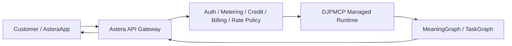
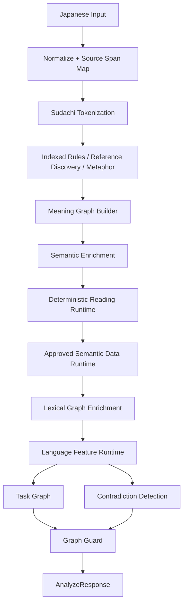

# Deterministic Japanese Parser MCP

<p align="center">
  <strong>日本語の語彙・文構造・意味範囲・照応・談話関係を、LLMなしで再現可能な構造へ変換する決定論的MCPサーバー</strong>
</p>

<p align="center">
  <strong>日本語</strong> ｜ <a href="README_EN.md">English</a>
</p>

<p align="center">
  <a href="https://github.com/seigo-gace/Deterministic-Japanese-Parser-MCP/actions/workflows/ci.yml"></a>
</p>

## 概要

Deterministic Japanese Parser MCP（DJPMCP）は、日本語入力を**生成AIに推測させる前に、機械が検証・再利用できる構造へ変換する**ための決定論的Parser / MCP Serverです。

中心となる出力は `MeaningGraph` です。入力文を単なる「意図ラベル」へ縮約せず、語彙候補、Entity、Clause、Proposition、述語・項、否定・条件・数量・モダリティ、引用帰属、照応、談話関係、未解決要素などを保持します。命令・依頼など実行候補を含む場合は、同じ読解結果から `TaskGraph` と外部操作可否も導出します。

このプロジェクトは**回答文を生成するAIではありません**。曖昧な主語・対象・語義・因果を根拠なく補完して外部操作へ進めることも目的としていません。

| 項目 | 現行実装 |
|---|---|
| Version | `0.4.0` |
| MCP Tool | `analyze_japanese` |
| MCP Transport | stdio / Streamable HTTP |
| Parser REST API | `POST /v1/analyze` |
| Python API | `ParserEngine().analyze(AnalyzeRequest(...))` |
| Python | 3.10以上 |
| 形態解析 | SudachiPy + SudachiDict Core |
| 実行時LLM | 使用しない |
| 外部辞書API | Runtimeでは使用しない |
| Program License | MIT |

---

## 利用形態：Public OSSとOfficial Hosted Service

DJPMCPは、**公開RepositoryからDownloadして自分で実行するOpen Source Parser Core**と、Project OwnerがServer上で運用しAstera Platform / AsteraAppから提供する**Official Hosted Commercial Service**の両方を前提に設計されています。

この二つは「機能を削った無料版」と「閉じた有料版」という関係ではありません。

| | Public OSS / Self-host | Astera Hosted Commercial Service |
|---|---|---|
| Parser Core | GitHubから取得して利用 | Managed Runtimeとして利用 |
| Install / Upgrade | 利用者が管理 | 運営側が管理 |
| Infrastructure | 利用者が用意 | 運営側が提供 |
| Account / Auth | 利用者側で構築 | Astera Platformで提供 |
| Usage Metering | 利用者側で構築 | Platformで提供 |
| Credit / Billing | 利用者側で構築 | Platformで提供 |
| Rate / Quota | 利用者側で構築 | Platformで提供 |
| Monitoring / Rollback | 利用者側 | 運営側 |
| Support / SLA | OSSとして保証なし | Commercial Termsで定義可能 |
| Astera Integration | 別途 | Official Integrationとして提供可能 |

### Public OSS Distribution

RepositoryのProgram CodeはMIT Licenseです。利用者は、自分のPC・Server・Container・Private Network等へInstallして、stdio MCP、Streamable HTTP、REST、Python APIを利用できます。

Self-host時のInfrastructure、Authentication、Monitoring、Scaling、Backup、Availability等は利用者側の責務です。また、Third-party DataにはProgram Codeとは別のSource Licenseが適用される場合があります。

### Astera Hosted Commercial API

Project Owner管理Server上のDJPMCP Runtimeを、AsteraApp / Astera Platformから**Managed APIとして有料提供する構成**を想定しています。

商用価値は公開Coreを隠すことではなく、Coreの外側へ次を統合して、Install・運用なしで利用できるPlatformにすることです。

- Customer account / authentication
- API credential lifecycle
- authorization
- usage metering
- credit / quota
- billing / plan integration
- rate limiting
- tenant isolation
- abuse protection
- operational monitoring
- version rollout / rollback
- support / commercial terms
- Astera integration

**重要:** このRepositoryの `POST /v1/analyze` はParser RuntimeのHTTP interfaceです。将来のCustomer-facing有料APIは、これをInternetへそのまま公開するのではなく、Astera API Gateway / Commercial Control Planeの内側に置く設計を推奨します。



商用PlatformのCustomer-facing URL、料金、Plan、SLAなどは、このParser RepositoryのVersionだけから推測せず、Astera Platform側で正式公開された情報をAuthorityとします。

詳しい境界：

- [`docs/COMMERCIAL_AND_DISTRIBUTION_MODEL.md`](docs/COMMERCIAL_AND_DISTRIBUTION_MODEL.md) — OSS配布と商用Hosted Serviceの関係
- [`docs/ASTERA_HOSTED_API_ARCHITECTURE.md`](docs/ASTERA_HOSTED_API_ARCHITECTURE.md) — Astera有料APIの責務分離・Request Flow・Metering/Billing境界
- [`docs/PRODUCTION_HTTP_DEPLOYMENT.md`](docs/PRODUCTION_HTTP_DEPLOYMENT.md) — Production HTTP Runtimeの公開可能な安全構成

---

## 何ができるか

### 1. 日本語をMeaning Graphへ変換

次の情報を独立した構造として保持します。

- 原文と正規化文の対応
- Token / 語彙情報
- Entityとmention
- Clause
- Proposition
- 語義候補と確信度
- 述語・項構造
- 係り関係
- 否定・条件・数量・程度・時制・相・態・モダリティのscope
- 引用・伝聞・発話帰属
- 指示語・省略・会話文脈を使った照応
- 因果・対比・順序・目的などの談話関係
- 曖昧性、不足情報、矛盾、未対応要素
- 意味グラフの `semantic_hash`

### 2. 読解専用Runtime

`reading_analysis` では、単語列だけではなく文の内部構造を返します。

主な構造：

- `predicate_frames`
- `dependency_arcs`
- `scope_operators`
- `attribution_frames`
- `discourse_relations`
- unresolved reading elements

例：

```text
すべての問題を解決できるわけではない。
```

このような文では、数量表現と否定を一つのラベルに潰さず、適用範囲を分離して保持することを狙います。

### 3. 語彙・意味Runtime

Engineは複数の意味情報源を段階的に統合します。

- system / user dictionary
- semantic profile
- compiled semantic data
- canonical dictionary runtime projection
- lexical graph enrichment
- language-feature runtime
- metaphor / idiom rules
- deterministic intent rules

複数語義をContextだけで一意に決められない場合は、候補を残し `AMBIGUOUS` として扱えます。実行に関係する曖昧性は、External Action ModeでFail Closedの材料になります。

### 4. 指示・依頼をTask Graphへ変換

読解結果に実行候補がある場合は、`TaskGraph` を生成します。

- Task
- 対象
- 依存関係
- 順序
- 維持条件
- 禁止条件
- protected elementとの衝突
- 実行前に満たすべき条件

通常の説明文や引用中の命令を、無条件に「実行指示」へ変換する設計ではありません。

### 5. 外部操作をFail Closedで判定

`execution_mode="external_action"` のとき、Graph Guardは読解結果を使って外部操作へ進めるかを判定します。

代表的な停止要因：

- 対象が未解決
- 重要な照応が未解決
- 意味上重要な曖昧性が残る
- protected elementと変更指示が衝突する
- contradictionが存在する
- unsupported要素が実行判断に影響する
- deadline超過
- action/social系Language Featureが曖昧

停止時は `execution_allowed=false` と `blocked_reasons` を返します。

> DJPMCP自身は外部サービスを変更しません。実際の操作は呼び出し側の責務です。

---

## Parser Architecture



Engineの中心処理は `ParserEngine.analyze()` に集約されています。stdio MCP、Streamable HTTP MCP、REST API、Python APIは同じParser EngineとPydantic契約を利用します。

### 実行フェーズ

現行Engineは概ね次の順に処理します。

1. 入力長確認
2. 正規化と原文位置Map生成
3. Sudachi tokenization
4. indexed ruleによるintent candidate抽出
5. reference discovery
6. metaphor detection
7. reference resolution
8. Meaning Graph生成
9. semantic enrichment
10. reading analysis
11. approved semantic data enrichment
12. lexical graph enrichment
13. legacy intent/task view生成
14. Action Task Graph生成
15. contradiction detection
16. Graph Guard評価
17. status / metrics / version / hash確定
18. 必要時のみdiagnostic log出力
19. compiled language-feature runtimeによる最終補強

`analysis_depth` は `auto / fast / deep` を受けます。`deep` はDEEP結果を明示的に要求でき、`auto` はscope・reference・discourse・ambiguity等の解析結果から `analysis_path` を決定します。

---

## Quick Start — Public OSS / Self-host

### Linux / macOS

```bash
git clone https://github.com/seigo-gace/Deterministic-Japanese-Parser-MCP.git
cd Deterministic-Japanese-Parser-MCP
python -m venv .venv
. .venv/bin/activate
python -m pip install --upgrade pip
pip install -e .
djpmcp-validate
```

### Windows PowerShell

```powershell
git clone https://github.com/seigo-gace/Deterministic-Japanese-Parser-MCP.git
cd Deterministic-Japanese-Parser-MCP
python -m venv .venv
.\.venv\Scripts\Activate.ps1
python -m pip install --upgrade pip
pip install -e .
djpmcp-validate
```

開発・全テストを実行する場合：

```bash
pip install -e ".[dev]"
```

---

## MCP: stdioで使う

インストール後のMCP Server entrypointは `djpmcp` です。

```bash
djpmcp
```

MCP Client設定例：

```json
{
  "mcpServers": {
    "deterministic-japanese-parser": {
      "command": "/absolute/path/Deterministic-Japanese-Parser-MCP/.venv/bin/djpmcp"
    }
  }
}
```

Windowsでは例として：

```text
C:\path\Deterministic-Japanese-Parser-MCP\.venv\Scripts\djpmcp.exe
```

Server起動時にはprewarmを行い、Sudachiのlazy initialization、schema生成、rule index、metaphor matcher等をRuntime deadlineの外側で準備します。

---

## MCP: Streamable HTTPで使う

HTTP entrypointは `djpmcp-http` です。

### API Keyを設定

Linux / macOS：

```bash
export DJPMCP_HTTP_API_KEY='replace-with-a-long-random-secret'
djpmcp-http
```

PowerShell：

```powershell
$env:DJPMCP_HTTP_API_KEY = 'replace-with-a-long-random-secret'
djpmcp-http
```

既定値：

```text
Host: 127.0.0.1
Port: 8765
MCP endpoint: /mcp
Parser REST endpoint: /v1/analyze
Health: /healthz
Readiness: /readyz
```

`/healthz` と `/readyz` 以外は認証対象です。

```http
Authorization: Bearer <DJPMCP_HTTP_API_KEY>
```

または：

```http
X-API-Key: <DJPMCP_HTTP_API_KEY>
```

### ローカル限定で認証を無効化する場合

```bash
export DJPMCP_HTTP_ALLOW_UNAUTHENTICATED=1
djpmcp-http
```

これは明示的に信頼できるローカル環境向けです。Public Networkでは使用しないでください。

### HTTP Transportの現行Protection

- API Key middleware
- constant-time key comparison
- DNS rebinding protection
- allowed host制限
- allowed origin制限
- request body size上限
- JSON Content-Type検証
- stateless Streamable HTTP MCP
- `/healthz`
- prewarm完了後だけ200となる `/readyz`

Production配置の詳細：[`docs/PRODUCTION_HTTP_DEPLOYMENT.md`](docs/PRODUCTION_HTTP_DEPLOYMENT.md)

---

## Parser REST API

### `POST /v1/analyze`

これは**Parser Runtime interface**です。AsteraのCustomer-facing有料API Contractそのものではありません。

```bash
curl -X POST http://127.0.0.1:8765/v1/analyze \
  -H 'Authorization: Bearer YOUR_API_KEY' \
  -H 'Content-Type: application/json' \
  -d '{
    "original_text": "UIは維持する。APIだけ変更しろ。",
    "protected_elements": ["UI"],
    "execution_mode": "external_action",
    "analysis_depth": "auto",
    "deadline_ms": 50
  }'
```

主なHTTPエラー：

| HTTP | 意味 |
|---:|---|
| 400 | malformed JSON / invalid Content-Length |
| 401 | API Key不正または不足 |
| 413 | body size上限超過 |
| 415 | `Content-Type: application/json` ではない |
| 422 | `AnalyzeRequest` validation error |
| 503 | `/readyz` でprewarm未完了 |

---

## MCP Tool Reference

### `analyze_japanese`

MCP Serverが公開するToolは現行 `analyze_japanese` です。

#### Input

| Field | Required | Default | 内容 |
|---|---:|---|---|
| `original_text` | Yes | - | 解析する日本語。空文字列不可 |
| `conversation_context` | No | `[]` | 直前までの発話。照応・文脈解決に使用 |
| `known_entities` | No | `[]` | 呼び出し側が既知として渡す対象 |
| `protected_elements` | No | `[]` | 変更してはいけない対象 |
| `social_context` | No | empty model | 話者・相手・関係・場面など |
| `discourse_state` | No | `{}` | 呼び出し側が保持する談話状態 |
| `execution_mode` | No | `analysis` | `analysis` / `comparison` / `planning` / `external_action` |
| `analysis_depth` | No | `auto` | `auto` / `fast` / `deep` |
| `deadline_ms` | No | `50` | 1〜60,000ms。実処理ではhard deadline以下へclamp |

MCP引数例：

```json
{
  "original_text": "設定を確認してからAPIを変更しろ。UIは維持しろ。",
  "protected_elements": ["UI"],
  "execution_mode": "external_action"
}
```

#### Output

MCP `CallToolResult` は2種類の表現を同時に返します。

1. `structuredContent` — 完全な `AnalyzeResponse`
2. text content — compact summary

summary：

```text
overall_status
execution_allowed
proposition_count
predicate_frame_count
scope_operator_count
action_task_count
semantic_hash
```

完全なstructured outputの主要Field：

| Field | 内容 |
|---|---|
| `overall_status` | `COMPLETE` / `PARTIAL` / `FAILED` |
| `execution_allowed` | external actionへ進めるか |
| `blocked_reasons` | Fail Closed理由 |
| `original_text` | 入力原文 |
| `normalized_text` | 正規化結果 |
| `analysis_path` | `FAST` / `DEEP` / `FAILED` |
| `tokens` | Token情報 |
| `meaning_graph` | 読解の中心Graph |
| `task_graph` | Action Task Graph |
| `intents` | compatibility用intent view |
| `metaphors` | 比喩・慣用表現解析 |
| `references` | 照応解析 |
| `tasks` | compatibility用task view |
| `ambiguities` | 未解決の曖昧性 |
| `missing_information` | 判断に不足する情報 |
| `contradictions` | 矛盾・衝突 |
| `unsupported_elements` | 未対応要素 |
| `timeouts` | deadline関連情報 |
| `versions` | Runtime / dictionary等のversion情報 |
| `metrics` | 各phase latency・件数・deadline判定等 |

MCP Serverは `AnalyzeRequest.model_json_schema()` と `AnalyzeResponse.model_json_schema()` をToolのinput/output schemaとして公開します。

---

## Python API

```python
from deterministic_japanese_parser_mcp import AnalyzeRequest, ParserEngine

engine = ParserEngine()
response = engine.analyze(
    AnalyzeRequest(
        original_text="UIは維持する。APIだけ変更しろ。",
        protected_elements=["UI"],
        execution_mode="external_action",
        deadline_ms=50,
    )
)

print(response.overall_status)
print(response.meaning_graph)
print(response.task_graph)
print(response.execution_allowed)
print(response.blocked_reasons)
```

低遅延MCP Clientを組み込む場合は `LowLatencyClientSession` も公開されています。`analyze_japanese` のoutput schemaをPydantic `TypeAdapter` と照合し、validatorをreadiness時に準備して毎回のschema構築コストを避けます。

---

## DeterminismとCache

MCP stdio Serverは、完全成功かつhard deadline内の応答だけを**最大128件のin-process LRU response cache**へ保存します。

cache keyには次を含みます。

- AnalyzeRequestの全semantic input
- Engine instance
- hard deadlineへclampしたeffective deadline

cache hit時も `requested_deadline_ms`、latency、deadline判定などRequest固有metricsは更新されます。

`MeaningGraph.semantic_hash` はGraph内容から生成されます。同じ入力・文脈・辞書・Runtime versionから再現可能な意味構造を得ることが重要な設計目標です。

---

## Runtime設定

### Parser Engine

| Environment variable | Default | 内容 |
|---|---:|---|
| `DJPMCP_MAX_INPUT_LENGTH` | `20000` | 入力最大文字数 |
| `DJPMCP_MAX_CONTEXT_ITEMS` | `20` | 会話Context最大件数 |
| `DJPMCP_MAX_CANDIDATES` | `8` | 候補上限 |
| `DJPMCP_REGEX_TIMEOUT_MS` | `25` | regex timeout |
| `DJPMCP_TARGET_LATENCY_MS` | `10` | 目標latency |
| `DJPMCP_HARD_DEADLINE_MS` | `50` | Runtime hard deadline |
| `DJPMCP_MAX_GRAPH_NODES` | `512` | Graph node上限 |
| `DJPMCP_MAX_SCOPE_EDGES` | `1024` | scope edge上限 |
| `DJPMCP_LOG_PATH` | `logs/parser.jsonl` | PARTIAL/FAILED診断log |
| `DJPMCP_SYSTEM_DICT_DIR` | bundled system dict | system dictionary root |
| `DJPMCP_USER_DICT_DIR` | bundled user dict | user dictionary root |
| `DJPMCP_SEMANTIC_DATA_RUNTIME_DIR` | unset | semantic runtime root override |

`target_latency_ms` は1以上、`hard_deadline_ms >= target_latency_ms`、Graph上限は32以上でなければ起動時に拒否されます。

### HTTP Server

| Environment variable | Default | 内容 |
|---|---|---|
| `DJPMCP_HTTP_HOST` | `127.0.0.1` | bind host |
| `DJPMCP_HTTP_PORT` | `8765` | port |
| `DJPMCP_HTTP_WORKERS` | `1` | Uvicorn workers |
| `DJPMCP_HTTP_API_KEY` | unset | Runtime API Key |
| `DJPMCP_HTTP_ALLOW_UNAUTHENTICATED` | `false` | 認証なし起動を明示許可 |
| `DJPMCP_HTTP_MAX_BODY_BYTES` | `1048576` | request body上限 |
| `DJPMCP_HTTP_ALLOWED_ORIGINS` | empty | CORS許可originのCSV |
| `DJPMCP_HTTP_ALLOWED_HOSTS` | localhost系 | Transport security許可hostのCSV |

`DJPMCP_HTTP_API_KEY` が空で、かつ `DJPMCP_HTTP_ALLOW_UNAUTHENTICATED=1` でもない場合、HTTP Appは起動を拒否します。

Astera Commercial Platformでは、このRuntime KeyをCustomer API Keyと兼用しません。Customer CredentialはGateway側、Runtime CredentialはInternal Service側で分離します。

---

## 辞書・Runtime Data

このRepositoryは、単一の巨大YAMLだけに全責務を持たせず、役割ごとにDataとCompiled Runtimeを分離しています。

主な配布対象：

```text
dictionaries/system/
├─ synonyms.yaml
├─ semantic_profiles.yaml
├─ task_templates.yaml
├─ metaphors/
├─ rules/
├─ synonyms.d/
├─ task_templates.d/
├─ language_features.d/
└─ compiled/
   ├─ language_features.d/
   ├─ open_lexicon/
   ├─ semantic_data/
   ├─ canonical_dictionary_public/
   ├─ canonical_dictionary_runtime/
   └─ direct_final_support/
```

### Canonical Dictionaryの公開境界

内部canonical master dictionaryそのものはdefault public wheelへ含めません。再配布条件を満たすpublic viewとRuntime projectionを分離して配布する構成です。

### Runtime rootの選択

Semantic Runtimeは次の優先順で解決されます。

1. `DJPMCP_SEMANTIC_DATA_RUNTIME_DIR`
2. `compiled/canonical_dictionary_runtime` が存在すればそれを使用
3. `compiled/semantic_data`

この境界により、内部正本・公開可能Data・実行用projectionを混同しない設計になっています。

詳細：

- [`docs/LANGUAGE_DATA_RUNTIME.md`](docs/LANGUAGE_DATA_RUNTIME.md)
- [`docs/OPEN_DICTIONARY_SUPPLY_CHAIN.md`](docs/OPEN_DICTIONARY_SUPPLY_CHAIN.md)
- [`docs/DIRECT_FINAL_RUNTIME_DEPLOYMENT.md`](docs/DIRECT_FINAL_RUNTIME_DEPLOYMENT.md)
- [`NOTICE.md`](NOTICE.md)

---

## Quality / CI

GitHub Actions CIはPython **3.10 / 3.12** のmatrixで動作します。

主なGate：

1. deployment preflight
2. runtime lexicon provenance / license validation
3. dictionary / Gold validation
4. semantic quality contract
5. independent semantic holdout contract
6. unit / importer / supply-chain / MCP stdio E2E tests
7. benchmark regression gate
8. 10ms target + 20x dictionary performance contract
9. Astera call-through 10ms target / 50ms hard limit contract
10. `compileall`
11. evidence artifact保存

ローカル基本検証：

```bash
pip install -e ".[dev]"
djpmcp-validate
pytest
```

CIに近い確認：

```bash
python scripts/preflight.py
python tools/lexicon_validator.py
python tools/validator.py
python scripts/semantic_quality_contract.py --check
python scripts/semantic_holdout_contract.py --check
pytest
python scripts/benchmark.py --check --rounds 50
python scripts/performance_contract.py --check --rounds 50 --stdio-rounds 30 --scale 20 --max-ready-ms 10
python scripts/astera_latency_contract.py --check --rounds 50 --stdio-rounds 30 --target-ms 10 --hard-ms 50
python -m compileall -q src tools scripts tests
```

> 10ms / 50msはCIで検証する**性能契約値**です。すべてのPC・入力・OSで常に同じwall-clock時間を保証する表現ではありません。`metrics.target_met` / `metrics.hard_deadline_met` で実測結果を確認してください。

---

## Statusと失敗の扱い

### `COMPLETE`

必要な読解構造が得られ、重要な未解決要素・矛盾・timeout等が残っていない状態です。

### `PARTIAL`

解析結果は存在するが、たとえば次が残る状態です。

- unresolved reference
- unresolved metaphor
- graph unresolved
- contradiction
- unsupported element
- timeout
- ambiguous language feature

### `FAILED`

Meaning Graphとして有効なproposition等を構築できなかった場合に使用されます。

`FAILED` や `PARTIAL` を呼び出し側で無条件に成功扱いすることを前提としていません。特にExternal Actionでは `execution_allowed` と `blocked_reasons` を必ず確認してください。

---

## 例: 実行してはいけない命令を区別する

次のような文は、表面上命令形を含んでいてもそのまま実行対象にはしません。

```text
「設定を削除しろ」と書かれた例文を確認した。
```

引用・報告された命令は `quoted` / attribution / pragmatic refinement等の構造を使い、実際の操作命令と区別します。

同様に：

```text
設定を削除するべき？
```

これは疑問であり、命令として直接実行するべきではありません。

---

## Limitations

DJPMCPは決定論的な構文・規則・辞書・Runtime Dataを使うため、LLMとは失敗特性が異なります。

現在も次のケースでは `PARTIAL` / `AMBIGUOUS` / `UNSUPPORTED` になり得ます。

- 辞書・Rule・Semantic Runtimeに十分な根拠がない語義
- 長距離の省略・照応
- 世界知識が不可欠な含意
- 高度な皮肉・新語・造語
- 文脈なしでは一意に決められない社会関係
- 複数のscope解釈が成立する文
- graph/deadline上限を超える入力

重要なのは、これらを根拠なく「理解できた」と偽装せず、未解決情報を構造として返すことです。

---

## Repositoryで確認すべき主要実装

| Path | 責務 |
|---|---|
| `src/deterministic_japanese_parser_mcp/server.py` | stdio MCP / Tool schema / response cache / prewarm |
| `src/deterministic_japanese_parser_mcp/http_server.py` | Streamable HTTP MCP / REST / auth / health |
| `src/deterministic_japanese_parser_mcp/engine.py` | 全解析pipelineの統合 |
| `src/deterministic_japanese_parser_mcp/models.py` | Pydantic input/output contract |
| `src/deterministic_japanese_parser_mcp/reading_runtime.py` | 述語項・scope・attribution・discourse読解 |
| `src/deterministic_japanese_parser_mcp/semantic_enrichment.py` | 意味補強 |
| `src/deterministic_japanese_parser_mcp/semantic_data_runtime.py` | compiled semantic data runtime |
| `src/deterministic_japanese_parser_mcp/lexical_graph.py` | lexical graph enrichment |
| `src/deterministic_japanese_parser_mcp/language_features.py` | compiled language-feature runtime |
| `src/deterministic_japanese_parser_mcp/language_feature_refinement.py` | Engineへのlanguage feature統合 / Fail Closed補強 |
| `src/deterministic_japanese_parser_mcp/anaphora.py` | 照応・指示解決 |
| `src/deterministic_japanese_parser_mcp/graph_guard.py` | External Action Guard |
| `src/deterministic_japanese_parser_mcp/graph_contradictions.py` | Graph上の矛盾検出 |
| `src/deterministic_japanese_parser_mcp/task_graph.py` | Action Task Graph |
| `src/deterministic_japanese_parser_mcp/low_latency_client.py` | schema-safe低遅延MCP client |
| `scripts/` | benchmark / quality / performance / deployment contracts |
| `tools/` | dictionary compile / validation / import / review tooling |
| `tests/` | unit / integration / E2E / regression / supply-chain検証 |
| `.github/workflows/ci.yml` | 公開CI Gate |

---

## Documentation Map

### 利用・商用・Deployment

- [`docs/README.md`](docs/README.md) — 公開Document Index
- [`docs/COMMERCIAL_AND_DISTRIBUTION_MODEL.md`](docs/COMMERCIAL_AND_DISTRIBUTION_MODEL.md) — OSS配布とOfficial Hosted Service
- [`docs/ASTERA_HOSTED_API_ARCHITECTURE.md`](docs/ASTERA_HOSTED_API_ARCHITECTURE.md) — Astera商用API Platformの責務分離
- [`docs/PRODUCTION_HTTP_DEPLOYMENT.md`](docs/PRODUCTION_HTTP_DEPLOYMENT.md) — Production HTTP配置
- [`docs/DIRECT_FINAL_RUNTIME_DEPLOYMENT.md`](docs/DIRECT_FINAL_RUNTIME_DEPLOYMENT.md) — Runtime Bundle Deployment

### Parser / Semantic Contract

- [`docs/JAPANESE_READING_CONTRACT.md`](docs/JAPANESE_READING_CONTRACT.md)
- [`docs/SEMANTIC_QUALITY_CONTRACT.md`](docs/SEMANTIC_QUALITY_CONTRACT.md)
- [`docs/LANGUAGE_DATA_RUNTIME.md`](docs/LANGUAGE_DATA_RUNTIME.md)
- [`docs/OPEN_LEXICON_ACCURACY.md`](docs/OPEN_LEXICON_ACCURACY.md)
- [`docs/OPEN_DICTIONARY_SUPPLY_CHAIN.md`](docs/OPEN_DICTIONARY_SUPPLY_CHAIN.md)
- [`docs/PERFORMANCE_AND_RELEASE_CONTRACT.md`](docs/PERFORMANCE_AND_RELEASE_CONTRACT.md)

### Project Policy

- [`LICENSE`](LICENSE)
- [`NOTICE.md`](NOTICE.md)
- [`GOVERNANCE.md`](GOVERNANCE.md)
- [`TRADEMARK.md`](TRADEMARK.md)
- [`SECURITY.md`](SECURITY.md)
- [`CONTRIBUTING.md`](CONTRIBUTING.md)

---

## Security

- stdio transportはMCP Clientとlocal processの信頼境界内で使用してください。
- Self-host HTTP公開時はAPI Key、TLS、Reverse Proxy、Firewall等を適切に構成してください。
- `DJPMCP_HTTP_ALLOWED_HOSTS` と `DJPMCP_HTTP_ALLOWED_ORIGINS` はEnvironmentに合わせて明示してください。
- Runtime DictionaryやCompiled Artifactを差し替える場合はvalidator / provenance / license Gateを通してください。
- Production Secret、Customer Credential、Billing SecretをPublic Repositoryへ保存しないでください。
- Astera Commercial APIでは、Customer CredentialをParser Runtime Keyと兼用せずGateway側で管理します。
- Commercial Public APIにはParser HTTP Serverだけでなく、Customer Auth、Quota、Rate Limit、Billing Authority、Idempotency、Tenant Isolation等の外側のControlが必要です。

詳細：[`docs/PRODUCTION_HTTP_DEPLOYMENT.md`](docs/PRODUCTION_HTTP_DEPLOYMENT.md)

---

## 開発方針

このRepositoryでは次の境界を重視しています。

- **生成と読解を分離する**
- **Meaning GraphとTask Graphを分離する**
- **通常文と実行指示を混同しない**
- **辞書正本・公開Data・Runtime projectionを分離する**
- **曖昧性を無理に確定しない**
- **外部操作はFail Closedにする**
- **Parser CoreとCommercial Control Planeを分離する**
- **Customer identity / billingをParserへ埋め込まない**
- **性能値は宣伝文ではなくCI contractで検証する**
- **出力schemaをMCP Tool contractそのものとして公開する**

---

## License / Data / Commercial Terms / Brand

Program CodeはMIT Licenseです。MIT LicenseはProgram Codeについて利用・改変・再配布・販売等を許可します。Project OwnerがOfficial Hosted Commercial Serviceを有料提供することは、この公開Licenseと両立します。

一方で、次はProgram CodeのMIT Licenseとは別の境界です。

- Third-party Dictionary / DataのSource License
- Astera / DJPMCP / Shiori等のProject Marks
- Official Hosted Serviceの料金・SLA・Support・Terms
- Customer Account / Billing / Platform Policy

Hosted Service Termsは、RepositoryのMIT Licenseで既に付与されたProgram Code上の権利を遡って取り消すものではありません。

詳細：

- [`LICENSE`](LICENSE)
- [`NOTICE.md`](NOTICE.md)
- [`GOVERNANCE.md`](GOVERNANCE.md)
- [`TRADEMARK.md`](TRADEMARK.md)
- [`docs/COMMERCIAL_AND_DISTRIBUTION_MODEL.md`](docs/COMMERCIAL_AND_DISTRIBUTION_MODEL.md)

<!-- project-control-ja:start -->
プロジェクトの管理方針、Official Release、Hosted / Commercial Offering、名称・ロゴの扱いは[`GOVERNANCE.md`](GOVERNANCE.md)と[`TRADEMARK.md`](TRADEMARK.md)を参照してください。
<!-- project-control-ja:end -->