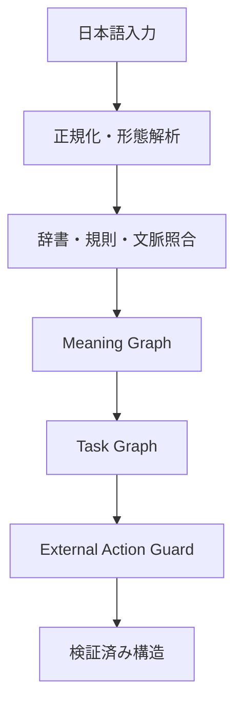

# Deterministic Japanese Parser MCP

<p align="center">
  <strong>日本語の指示・条件・禁止・例外・参照関係を、生成AIなしで再現可能な構造へ変換するMCPサーバー</strong>
</p>

<p align="center">
  <strong>日本語</strong> ｜ <a href="README_EN.md">English</a>
</p>

<p align="center">
  <a href="https://github.com/seigo-gace/Deterministic-Japanese-Parser-MCP/actions/workflows/ci.yml"></a>
</p>

| 項目 | 内容 |
|---|---|
| MCPツール | `analyze_japanese` |
| 実行方式 | 非AI・非生成・決定論的 |
| 接続方法 | MCP標準入出力（stdio）、Python API |
| 対応環境 | Python 3.10以上 |
| 外部接続 | 実行時のAI API・辞書API接続なし |
| プログラムライセンス | MIT |

[すぐに試す](#すぐに試す) ｜ [MCPへ接続する](#mcpへ接続する) ｜ [入力と出力](#入力と出力) ｜ [辞書データ](#辞書データ) ｜ [検証](#検証) ｜ [限界](#限界)

## 何をするMCPか

このMCPは、日本語を回答文へ変換するものではありません。日本語の依頼や説明を解析し、後続システムが判断に使える次の構造を返します。

- 誰が、何を、何に対して求めているか
- 条件、例外、禁止、維持、優先順位、順序、依存関係
- 引用、疑問、仮定、伝聞、訂正、撤回
- 省略された対象、未解決の参照、多義性、矛盾
- 実行候補と、その実行を許可または停止する理由

たとえば「UIは維持する。APIだけ変更しろ。」という入力から、`UI`を保護対象、`API`を変更対象として分離し、Meaning Graph（意味グラフ）、Task Graph、外部操作の安全判定を返します。

### できること／しないこと

| できること | しないこと |
|---|---|
| 日本語を型付きMeaning Graphへ変換する | 回答文や会話文を生成する |
| Taskと制約をTask Graphへ整理する | 外部サービスを直接操作する |
| 条件・否定・引用・疑問の適用範囲を保持する | 根拠のない意味を推測で補う |
| 未解決・矛盾・時間超過時に外部操作を停止する | 実行時にLLMや外部辞書APIを呼ぶ |
| 同じ入力条件から同じ意味ハッシュを作る | すべての日本語を人間同等に理解する |

## すぐに試す

### Linux・macOS

```bash
git clone https://github.com/seigo-gace/Deterministic-Japanese-Parser-MCP.git
cd Deterministic-Japanese-Parser-MCP
python -m venv .venv
. .venv/bin/activate
pip install -e .
djpmcp-validate
```

### Windows PowerShell

```powershell
git clone https://github.com/seigo-gace/Deterministic-Japanese-Parser-MCP.git
cd Deterministic-Japanese-Parser-MCP
python -m venv .venv
.\.venv\Scripts\Activate.ps1
pip install -e .
djpmcp-validate
```

開発・全テストを行う場合だけ、`pip install -e ".[dev]"`を使用してください。

## MCPへ接続する

MCPクライアントのサーバー設定へ、次のように登録します。`command`には、仮想環境内の`djpmcp`実行ファイルの絶対パスを指定するのが確実です。

```json
{
  "mcpServers": {
    "deterministic-japanese-parser": {
      "command": "/absolute/path/Deterministic-Japanese-Parser-MCP/.venv/bin/djpmcp"
    }
  }
}
```

Windowsでは、たとえば`C:\\path\\Deterministic-Japanese-Parser-MCP\\.venv\\Scripts\\djpmcp.exe`を指定します。接続後、MCPクライアントから`analyze_japanese`を呼び出せます。

## 入力と出力

### `analyze_japanese`の入力

| 項目 | 必須 | 既定値 | 説明 |
|---|---:|---|---|
| `original_text` | はい | — | 解析する日本語。空文字列は不可 |
| `conversation_context` | いいえ | `[]` | 参照解決に使う直前までの発話 |
| `known_entities` | いいえ | `[]` | 既知の人・物・組織・対象 |
| `protected_elements` | いいえ | `[]` | 変更してはいけない対象 |
| `social_context` | いいえ | 空 | 話者、相手、関係、場面、丁寧さ |
| `discourse_state` | いいえ | `{}` | 呼び出し側が保持する談話状態 |
| `execution_mode` | いいえ | `analysis` | `analysis` / `comparison` / `planning` / `external_action` |
| `analysis_depth` | いいえ | `auto` | `auto` / `fast` / `deep` |
| `deadline_ms` | いいえ | `50` | 1〜60,000ミリ秒 |

MCPツールへ渡す引数の例：

```json
{
  "original_text": "UIは維持する。APIだけ変更しろ。",
  "protected_elements": ["UI"],
  "execution_mode": "external_action",
  "analysis_depth": "auto",
  "deadline_ms": 50
}
```

### 主な出力

| 出力 | 内容 |
|---|---|
| `overall_status` | 全体結果：`COMPLETE` / `PARTIAL` / `FAILED` |
| `meaning_graph` | Entity、Clause、Proposition、語彙候補、Scope、未解決情報 |
| `task_graph` | Task、依存関係、維持・禁止・条件・検証条件 |
| `execution_allowed` | 外部操作へ進めるか |
| `blocked_reasons` | 停止した理由 |
| `ambiguities` / `contradictions` | 多義性と矛盾 |
| `missing_information` / `unsupported_elements` | 不足情報と未対応要素 |
| `versions` | 辞書・規則・Graphの版情報 |
| `metrics` | 処理時間、Deadline判定などの実行情報 |

同じ入力、会話文脈、辞書、規則版からは同じ`meaning_graph.semantic_hash`が得られます。

### Python API

```python
from deterministic_japanese_parser_mcp import AnalyzeRequest, ParserEngine

response = ParserEngine().analyze(
    AnalyzeRequest(
        original_text="UIは維持する。APIだけ変更しろ。",
        protected_elements=["UI"],
        execution_mode="external_action",
        deadline_ms=50,
    )
)

print(response.meaning_graph)
print(response.task_graph)
print(response.execution_allowed)
print(response.blocked_reasons)
```

## 処理の流れ



原文位置を保ったまま正規化し、Sudachiの形態情報、固定辞書、事前構築した規則索引、文法処理、範囲・参照・矛盾検出を組み合わせます。解析結果に重要な未解決項目があれば、推測で埋めずに明示します。

## 安全性

次のような表現は、そのまま外部操作として扱いません。

- 引用内の命令：「削除しろと言われた」
- 疑問：「削除するべき？」
- 仮定：「不要なら削除する」
- 対象が未解決の指示：「それを変更して」
- 維持対象と変更対象が衝突する指示
- Deadline内に重要な意味を確定できない入力

外部操作を許可できない場合は、`execution_allowed=false`と`blocked_reasons`で理由を返します。解析結果を利用して実際の操作を行うかどうかは、呼び出し側が最終判断します。

## 辞書データ

### 現在、標準Runtimeで使うデータ

| データ | 件数 | Runtimeでの役割 |
|---|---:|---|
| Open Lexicon | 120,000 | 表記・読み・品詞などの語彙同定。意味は自動承認していない |
| 比喩・慣用・語用表現 | 452 | 固定表現の解釈 |
| 決定論的な意図規則 | 339 | 要求・禁止・条件などの判定 |
| 意図種別 | 21 | 判定結果の分類 |
| 類義語グループ | 100 | 表記・意味の正規化 |
| Task Template | 63 | 作業構造の生成 |
| Workflow | 42 | 順序・依存関係の生成 |
| Gold Case | 649 | 回帰・品質検証 |

Open LexiconはJMdict由来の語彙情報を、語彙同定専用として12 Shardへ分割したものです。すべてのShardを一つの辞書として読み込み、同形異義語は一候補へ潰さず保持します。これは12万語すべての意味・語用・実行意図を理解できるという意味ではありません。

加工パイプラインでは、PR #26でJMdict意味候補を付与済みの12万件を、特殊語彙・方言・擬音語・若者言葉など約5,000件と合わせた125,000件の固定Review Queueとして扱います。5,000件だけを優先したり、12万件をReviewから除外したりしません。未承認の意味候補は標準Runtimeへ入りません。

12万件の再構築・索引・多義保持の検証値は[`docs/OPEN_LEXICON_ACCURACY.md`](docs/OPEN_LEXICON_ACCURACY.md)を参照してください。

### 辞書データの自動加工・統合

新しいデータは、入力元にかかわらず同じ非AIパイプラインで処理します。

| 入力種別 | 差し込み口 | 管理方法 |
|---|---|---|
| Open Lexicon 120,000件 | `dictionaries/system/lexicon.d/` | JMdict意味候補を保持し、共通Review Queueへ送る |
| 特殊・文脈語彙 5,000件 | `research/context_collection/expansion_v3/` | 共通Schema化し、同じReview Queueへ送る |
| 専門辞書 | `dictionaries/domain_packs/<domain>/` | Coreと物理的に分離 |
| 利用者データ | `dictionaries/user_packs/<pack>/` | 公式データを上書きせず併存 |

Pipelineは次を順番に行います。

1. 共通Schemaへの変換とNFKC正規化
2. 読み、品詞、語形、表記揺れの機械的整理
3. Source、Version、License、SHA-256の検査
4. 重複、同形異義、衝突、既存データとの関係候補の検出
5. 125,000件を区別せず、一つのReview Queueから最大20件のReview Batchへ分割
6. 各Recordの極性、0.0〜1.0の強度、必須／除外Context、Task候補、外部Action Riskを判断
7. 判断を`research/semantic_decisions/decision_ledger.jsonl`へ記録し、明示された承認だけを適用
8. 承認済みScopeだけを`core` / `domains` / `user`へCompile
9. Gold、独立Holdout、安全性、性能、WheelのOffline検証

承認はRecord単位の一括判定ではなく、`lexical`、`semantic`、`pragmatic`、`task`、`external_action`のScopeごとに行います。Compilerは未承認ScopeのFieldを除外します。

現在のPipelineはLLM APIを使用しません。GPTアプリは外部の作業主体として125,000件のReview Batchを順に読み、利用者が指示した判断をDecision Ledgerへ記録します。12万件のJMdict意味候補は上書きせず、不足している極性・強度・文脈・Task候補・外部Action Riskを追加します。Pipeline自身は判断を作らず、自動承認もしません。Reviewが残る場合、GitHub ActionsはEvidenceを保存したうえで`REVIEW_REQUIRED`として公開Gateを停止します。

実行例：

```bash
python tools/unified_semantic_data_pipeline.py --compile-approved
python tools/unified_semantic_data_pipeline.py --check
python tools/unified_semantic_data_pipeline.py --require-review-complete
```

詳細は[`docs/UNIFIED_SEMANTIC_DATA_PIPELINE.md`](docs/UNIFIED_SEMANTIC_DATA_PIPELINE.md)を参照してください。

## 検証

開発用Dependencyを導入してから実行します。

```bash
pip install -e ".[dev]"
python tools/lexicon_validator.py
python tools/validator.py
pytest
python scripts/benchmark.py --check
python scripts/performance_contract.py --check --max-ready-ms 10
python scripts/astera_latency_contract.py --check --target-ms 10 --hard-ms 50
python -m compileall -q src tools scripts tests
```

CIは辞書整合性、Meaning Graph、Task Graph、引用・疑問・否定・仮定・参照の安全性、MCP標準入出力、Offline Wheel、辞書20倍規模の性能を検証します。

| 性能境界 | 契約 |
|---|---:|
| 常駐済み内部処理の最適目標 | 5ミリ秒以下 |
| 通常呼び出し | p95 10ミリ秒以下 |
| 絶対上限 | 50ミリ秒以下 |
| 上限内に完了しない場合 | `TIMEOUT`として外部操作を停止 |

詳しい品質条件は[`docs/SEMANTIC_QUALITY_CONTRACT.md`](docs/SEMANTIC_QUALITY_CONTRACT.md)、性能条件は[`docs/PERFORMANCE_AND_RELEASE_CONTRACT.md`](docs/PERFORMANCE_AND_RELEASE_CONTRACT.md)に記載しています。

## 限界

- 皮肉、広い常識、複雑な省略、長い複数段落の談話を完全には扱えません。
- 地域・世代・共同体に強く依存する表現は、根拠が不足すれば未解決として返します。
- Open Lexiconの12万件は語彙同定データであり、全件の意味理解を保証しません。
- `execution_allowed`は解析上の安全判定です。認証、権限、業務ルール、法的判断を代替しません。
- このMCPは外部操作を実行しません。実行責任は呼び出し側にあります。

## 文書・サポート

| 目的 | 文書・窓口 |
|---|---|
| 文書全体の索引 | [`docs/README.md`](docs/README.md) |
| 使い方・導入・未確認の解析結果 | [GitHub Discussions](https://github.com/seigo-gace/Deterministic-Japanese-Parser-MCP/discussions) |
| 再現可能な不具合 | [GitHub Issues](https://github.com/seigo-gace/Deterministic-Japanese-Parser-MCP/issues/new?template=bug_report.yml) |
| 脆弱性の報告 | [`SECURITY.md`](SECURITY.md) |
| 検証への参加 | [`VALIDATION.md`](VALIDATION.md) |
| Contribution | [`CONTRIBUTING.md`](CONTRIBUTING.md) |
| 変更履歴 | [`CHANGELOG.md`](CHANGELOG.md) |

## ライセンスと出典

プログラムコードはMITライセンスです。詳細は[`LICENSE`](LICENSE)を参照してください。

外部辞書由来のデータには、各RecordとSource Manifestに記録された元データのライセンスが適用されます。現在のJMdict由来Open LexiconはCC BY-SA 4.0で、Electronic Dictionary Research and Development GroupへのAttributionを各Recordに保持しています。第三者Dependencyと辞書データの扱いは[`NOTICE.md`](NOTICE.md)に記載しています。

<!-- project-control-ja:start -->
プロジェクトの管理方針と名称・ロゴの扱いは[`GOVERNANCE.md`](GOVERNANCE.md)と[`TRADEMARK.md`](TRADEMARK.md)を参照してください。
<!-- project-control-ja:end -->
