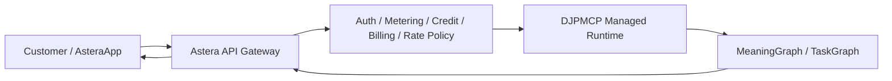

# Deterministic Japanese Parser MCP

<p align="center">
  <strong>日本語の語彙・文構造・意味・文脈・曖昧性を、LLMなしで再現可能な構造へ変換する決定論的MCPサーバー</strong>
</p>

<p align="center">
  <strong>日本語</strong> ｜ <a href="README_EN.md">English</a>
</p>

<p align="center">
  <a href="https://github.com/seigo-gace/Deterministic-Japanese-Parser-MCP/actions/workflows/ci.yml"></a>
</p>

## 1. 概要

Deterministic Japanese Parser MCP（DJPMCP）は、日本語入力を**生成AIや人間が判断する前段で、検証可能・再利用可能な構造へ変換する非AI・決定論的Parser / MCP Runtime**です。

目的は単純な辞書検索、Intent分類、命令検出、安全判定のどれか一つではありません。日本語が何を意味し、誰が何を何に対して述べ、何を要求・禁止・維持し、どの条件・例外・範囲・順序・依存が何へ作用するかを、後段AI／Astera／Agentが再読解・推測しなくても利用できる形へ構造化することです。

中心出力は `MeaningGraph` です。入力を単純なIntentラベルへ潰さず、語彙候補、Entity、Clause、Proposition、述語・項、係り関係、否定・条件・数量・モダリティ、引用帰属、照応、談話関係、語義候補、未解決要素などを保持します。命令・依頼などの実行候補がある場合は、その同じ意味解釈から `TaskGraph` と外部操作可否を導出します。

DJPMCPは次をしません。

- RuntimeでLLMに意味を推測させる
- 根拠のない意味・主語・対象・因果を補う
- Unknownを既知として扱う
- 曖昧な入力を無理に一意化する
- Recovery結果だけを理由に外部操作を許可する
- 外部サービスそのものを操作する

曖昧なら曖昧、不足なら不足、未知なら未知として返し、**判断材料を捏造しないこと**が設計の中心です。

---

## 2. 最上位の製品条件

DJPMCPの最上位目的は、必要な完全読解結果を：

> **0.5秒以下で、LLM・生成AIによる推測に頼らず、決定論的に返すこと。**

速度のために、以下を削ってはいけません。

- 読解精度
- MeaningGraph
- 曖昧性保持
- Reading Evidence
- Fail Closed
- External Action Safety

既存の `target_latency_ms=10` や `hard_deadline_ms=50` など、より厳しい値はHot-pathや局所Contractとして維持します。Recovery追加を理由に自動的に緩和しません。

Production Acceptanceでは、Hardware/CPU/RAM、warm/cold、入力長class、並列数、p50/p95/p99、MCP/HTTP境界、必要なPhase別Evidenceを明示します。**p95だけを最上位0.5秒条件の代替にはしません。**

---

## 3. 現在の実装と固定済みTarget Architectureを分けて読む

このRepositoryでは、**現行実装**と**実装中の固定済みTarget Architecture**を混同しません。

| 項目 | 状態 |
|---|---|
| Package Version | `0.4.0` |
| MCP Tool | `analyze_japanese` |
| MCP Transport | stdio / Streamable HTTP |
| Parser REST API | `POST /v1/analyze` |
| Python API | `ParserEngine().analyze(AnalyzeRequest(...))` |
| Python | 3.10以上 |
| 形態解析 | SudachiPy + SudachiDict Core |
| Runtime LLM | 使用しない |
| Runtime外部辞書API | 使用しない |
| MeaningGraph | `2.3.0` を既存Coreとして再利用 |
| TaskGraph / GraphGuard | 既存Coreとして再利用 |
| Program License | MIT |

### 固定済みTarget Architecture

```text
Original Authority
  ↓
Safe Normalize
  ↓
Sudachi Baseline
  ↓
Japanese-function Projection
  ↓
multi-lane Front Router
  ↓
必要IndexだけProgressive Retrieval
  ↓
Hard Constraint
  ↓
Soft Ranking
  ↓
Syntax / Sense Resolution
  ↓
必要時だけRecovery Zone
  ↓
bounded Candidate Lattice
  ↓
whole-sentence Top-K / Beam / Viterbi系Decode
  ↓
Margin / Evidence Gate
  ↓
Router再評価
  ↓
既存 MeaningGraph 2.3.0
  ↓
TaskGraph
  ↓
GraphGuard
```

このTargetの詳細正本は [`docs/PARSER_ARCHITECTURE.md`](docs/PARSER_ARCHITECTURE.md) です。

**重要:** 設計をRepositoryへ記載したことは実装完了の証拠ではありません。Target Architectureの各層は、Source・Test・Full Build/Audit・性能・Runtime readbackを個別に閉じて初めてPASSになります。

---

## 4. Architectureの最重要原則

### Original is Authority

原文をAuthorityとして保持します。正規化・表記揺れ処理・誤字Recoveryが行われても、原文を上書きしません。

### Evidence only

根拠がないものを補強して「もっともらしい意味」にしません。Sourceが意味を持たない補助Evidenceなら、そのEvidenceから語義を生成しません。

### Ambiguity retention

候補が競合し、Evidence/Score marginが不足する場合は `AMBIGUOUS` / `UNRESOLVED` / `INSUFFICIENT` を維持します。新語や未知表現を自動的に誤字扱いしません。

### Fail closed

`execution_mode="external_action"` では、安全に確定できない重要意味が残ると外部操作を止めます。RecoveryによりAction Predicate/Target/Intentが新しく成立した、または変化した場合も自動許可しません。

### Source / rights / provenance separation

Source全体を一括で「利用可」とみなしません。意味・読み・用法・例文・Translation・Relation・Metric・Alias・Ranking Evidence・Provenance等はField-levelで由来と権利を管理するTargetです。

### Runtime without LLM

候補生成、Routing、Lattice、Ranking、Safety Gateまで、Runtimeは非AI・決定論的に閉じます。

---

## 5. Canonical Dataと日本語機能別Projection

最新設計で対象とするCanonical processed setは **9,852,513 records** です。

これを一つの巨大検索対象として毎回総当たりするのではなく、同じCanonical Authorityから**日本語機能別のProjection**を構築します。

Primary lane：

1. `Orthography/Reading`
2. `Noun-Entity`
3. `Predicate-Inflection`
4. `Function Words`
5. `Connective-Modifier`
6. `Onomatopoeia`
7. `Multiword`
8. `Syntax-Case-Clause`
9. `Sense-Semantic Relation`
10. `Usage-Context-Pragmatics`
11. `Document Structure`
12. `Evidence-Provenance-Rights`

Domain、translation、sentiment、temporal、frequency等はSecondary Facetです。Domain分類だけを主Routerにして意味解釈を決めません。

ProjectionはCanonical Recordの派生View/Indexであり、別の意味正本ではありません。

Buildでは少なくとも以下を固定・検証します。

- Source Record identity
- Canonical lineage
- Projection assignment
- Rejected / Unmapped accounting
- Rights / Provenance
- Deterministic Manifest / Hash
- `canonical_manifest_sha`
- `schema_version`
- `projection_policy_version`
- `scoring_policy_version`

互換しないBundle組合せは起動拒否し、Bundle切替はset単位でAtomic / Rollback可能にします。

---

## 6. Front multi-lane RouterとProgressive Retrieval

Front Routerは入力を見て、必要なLane・Facet・Indexを決定論的に選択します。

Routerの責務は**意味を決めることではなく、何を検索すべきかを絞ること**です。

単一Laneを早期に決め打ちせず、primary / secondary / fallback候補を保持します。

Router TraceのTarget：

- detected input features
- `router_decision`
- `candidate_lanes`
- `selected_lanes`
- skipped laneと理由
- Secondary Facet
- `fallback_reason`
- Retrieval limit
- Recovery候補の必要性
- Router / Projection Version

`exact=0 / OOV / segmentation suspicious / grammar conflict / syntax conflict` 等ではFallbackまたはRecoveryへ昇格し、Recovery後はRouterを再評価します。

Progressive Retrievalは機能を削る仕組みではありません。必要なEvidenceから段階的に読み、解決できた時点で不要な深い検索を避ける仕組みです。

---

## 7. Purpose Routingの位置付け

Purpose Routingは残しますが、意味の正本にはしません。

Purpose / Source Roleが担当するもの：

- Retrieval Hint
- Role Mask
- Consumer allow/deny
- Permission境界
- Provenance / Ranking / Evidence補助

Purpose Routingが担当しないもの：

- 最終意味の決定
- Japanese-function Laneの代替
- 補助Evidenceからの語義生成
- Field-level Rights Gateの迂回
- Unknown Roleの暗黙許可

つまり、**Purposeは「どの材料を誰が使えるか」の補助線であり、「この文はこの意味だ」と決めるAuthorityではありません。**

---

## 8. Hard ConstraintとSoft Ranking

Hard Constraintは「候補として参加してよいか」、Soft Rankingは「参加可能な候補をどの順に評価するか」を担当します。

Hard Constraint例：

- Source / Field Rights
- Reading / POS不整合
- Consumer Role禁止
- Protected Element競合
- Impossible Span / Segmentation
- Provenance必須なのに欠落
- External Action Safety

Soft Ranking例：

- Exact Surface / Reading
- Morphology
- Segmentation / Connection
- Syntax / Case / Clause
- Sense / Context
- Domain Facet
- Source Quality / Evidence Strength
- Recovery / Edit Cost

高ScoreでもHard Constraintを越えてはいけません。

---

## 9. 誤字・崩れ文・Noisy Input Recovery

### 誤字専用巨大DBは作らない

誤字の全組み合わせを事前登録する方式ではありません。また全文を常時Fuzzy化しません。

Target Recovery Flow：

```text
Original Input
  ↓
Safe Normalization
  ↓
Exact / Normal Analysis
  ↓
未解決・OOV・異常分割・Grammar/Syntax ConflictのみRecovery Zone
  ↓
隣接境界を含むSpan候補
  ↓
Surface / Reading / Alias / Morphology / Split-Merge候補
  ↓
Deterministic Recovery Cost
  ↓
Bounded Candidate Lattice
  ↓
Whole-sentence Top-K / Beam / Viterbi系Decode
  ↓
Reading / POS / Segmentation / Syntax / Sense / Context / Facet / Evidenceで再評価
  ↓
Margin + Evidence Gate
  ├─ 十分 → Recovery採用 → Router再評価
  └─ 不足 → AMBIGUOUS / UNRESOLVED
```

Recovery候補は、かな/カナ、濁点・半濁点、小書き、長音、送り仮名、縮約、文字挿入/削除/置換/転置、split/merge等の有限候補から生成し、Runtime Dataに実在するsurface/lemma/reading/aliasへ着地するものだけを昇格します。

`beam width / max span / max candidates / max passes / recovery margin` は推測値で永久固定せず、Golden / Noise / Latency Benchmarkで校正します。

Recoveryでは次を守ります。

- 原文を残す
- Original SpanへEvidenceを紐づける
- 修正候補と採用理由を追跡できる
- 未知語を誤字と断定しない
- Protected Elementを勝手に変えない
- 複数Meaningが成立しMargin不足なら曖昧を保持する
- RecoveryでAction意味が新規成立・変化した場合はFail Closed

---

## 10. Existing MeaningGraph / TaskGraph / GraphGuard

Target Architectureは既存Coreを捨てません。

### MeaningGraph `2.3.0`

既存Coreは以下のような構造を保持します。

- Entity
- Clause
- Proposition
- Lexical Node
- Scope Edge
- Reading Analysis
- Language Feature
- Unresolved element
- Decision state change
- Evidence rule
- Context version
- Quality annotation
- `semantic_hash`

### Reading Analysis

主な構造：

- `predicate_frames`
- `dependency_arcs`
- `scope_operators`
- `attribution_frames`
- `discourse_relations`
- paragraph/document analysis
- unresolved reading elements

### TaskGraph

実行候補がある場合、意味解釈からTaskを構造化します。

- Action
- Target
- Dependencies
- Constraints
- Completion criteria
- Verification criteria
- External-action flag

### GraphGuard

External Action時の最終Semantic Safety境界です。

代表的Blocker：

- 対象未解決
- 重要Reference未解決
- 意味上重要なAmbiguity
- Protected Elementとの衝突
- Contradiction
- Actionに影響するUnsupported要素
- Deadline / Processing failure
- Recoveryにより新規・変更されたAction意味がEvidence Gateを満たさない

RecoveryでAction Predicate/Target/Intentが新しく成立または変化した場合、`RECOVERY_CHANGED_ACTION_SEMANTICS` 相当でFail ClosedするTargetです。

Parserの `execution_allowed` は意味安全性判定であり、実システムの認可・承認そのものではありません。Provider/OS等の実Actionは呼出側の別Authorization / Approval境界を必須とします。

DJPMCP自身は外部サービスを変更しません。

---

## 11. semantic_hash互換性

現行 `MeaningGraph` は `semantic_hash` 自身を除くGraph内容をHash対象にしています。

そのため、MeaningGraphへDefault Fieldを追加しただけでも、既存入力のHashが変化する可能性があります。

Recovery / Interpretation Evidence、Router Trace、Field-level Evidence参照をGraphへ接続する前に、**semantic_hash compatibility Gate**を先に実装します。

許されるのは次のどちらかです。

1. 既存Hash契約を変えずExtensionを保持できることをTestで証明する
2. Hash / Graph Version Migrationを明示的に設計・Test・Releaseする

意図しないHash driftは許可しません。

---

## 12. MCP Output Profile Target

MCPは同じSemantic Resultを用途別に運ぶため次のTransport Profileを持ちます。

```text
McpAnalyzeRequest = AnalyzeRequest + transport-only output_profile
output_profile = compact | standard | full
Default = compact
```

これはCore `AnalyzeRequest` の意味入力ではなく、MCP Transport専用の設定です。

### `compact`

**Default。** Status、主要Reading / Proposition、重要Ambiguity / Missing、Action Safety、`semantic_hash` 等の軽量判断材料を返します。

内部MeaningGraphの完全性は削りません。

### `standard`

Semantic Structure、Task、Reading Detail、Evidence関連情報を段階的に増やしつつ、最も重い転送DetailはSchema互換範囲で省きます。

### `full`

既存の完全 `AnalyzeResponse` structured shapeを明示要求時に返します。

### 重要な互換条件

- ProfileはParser意味解釈を変えない
- Core `AnalyzeRequest` へ混ぜない
- Cache Identityを変えない
- `semantic_hash` を変えない
- Text SummaryはBackward Compatible
- CacheにはFull Semantic Resultを保持しProfileごとの別Semantic Cacheを作らない
- Profile最大Byte / Node / Candidate露出上限は実Context/Latency Benchmarkで決める
- 軽量化のために内部MeaningGraphを削らない

**このREADME更新時点ではM0-1のTarget設計は固定済みですが、VPS Source/Runtimeへの実適用・targeted testは別Evidenceです。**

---

## 13. 現行MCP / Python Interface

### MCP Tool

```text
analyze_japanese
```

現行Core入力は `AnalyzeRequest` です。

| Field | Required | Default | 内容 |
|---|---:|---|---|
| `original_text` | Yes | — | 解析対象の日本語。空文字不可 |
| `conversation_context` | No | `[]` | 会話文脈 |
| `known_entities` | No | `[]` | 既知Entity |
| `protected_elements` | No | `[]` | 変更禁止対象 |
| `social_context` | No | empty | 話者・相手・社会文脈 |
| `discourse_state` | No | `{}` | 呼出側が保持する談話状態 |
| `execution_mode` | No | `analysis` | `analysis / comparison / planning / external_action` |
| `analysis_depth` | No | `auto` | `auto / fast / deep` |
| `deadline_ms` | No | `50` | 1–60,000ms |

M0-1ではMCP Transport側だけに `output_profile` を追加し、Core `AnalyzeRequest`へは渡しません。

### Python API

```python
from deterministic_japanese_parser_mcp import AnalyzeRequest, ParserEngine

response = ParserEngine().analyze(
    AnalyzeRequest(
        original_text="UIは維持する。APIだけ変更しろ。",
        protected_elements=["UI"],
        execution_mode="external_action",
        deadline_ms=50,
    )
)

print(response.meaning_graph)
print(response.task_graph)
print(response.execution_allowed)
```

Python Core APIはMCP Output Profileに依存しません。

---

## 14. Public OSS / Self-host Quick Start

### Linux / macOS

```bash
git clone https://github.com/seigo-gace/Deterministic-Japanese-Parser-MCP.git
cd Deterministic-Japanese-Parser-MCP
python -m venv .venv
. .venv/bin/activate
python -m pip install --upgrade pip
pip install -e .
djpmcp-validate
```

### Windows PowerShell

```powershell
git clone https://github.com/seigo-gace/Deterministic-Japanese-Parser-MCP.git
cd Deterministic-Japanese-Parser-MCP
python -m venv .venv
.\.venv\Scripts\Activate.ps1
python -m pip install --upgrade pip
pip install -e .
djpmcp-validate
```

開発用依存関係：

```bash
pip install -e ".[dev]"
```

---

## 15. MCP stdio

Installed entrypoint：

```bash
djpmcp
```

MCP Client例：

```json
{
  "mcpServers": {
    "deterministic-japanese-parser": {
      "command": "/absolute/path/Deterministic-Japanese-Parser-MCP/.venv/bin/djpmcp"
    }
  }
}
```

Windows例：

```text
C:\path\Deterministic-Japanese-Parser-MCP\.venv\Scripts\djpmcp.exe
```

Serving loopへ入る前にprewarmし、Sudachi lazy initialization、Schema、Rule Index、代表経路などをRuntime deadline外で準備します。

---

## 16. Streamable HTTP / REST

HTTP entrypoint：

```bash
djpmcp-http
```

API Key：

```bash
export DJPMCP_HTTP_API_KEY='replace-with-a-long-random-secret'
djpmcp-http
```

既定：

```text
Host: 127.0.0.1
Port: 8765
MCP endpoint: /mcp
Parser REST endpoint: /v1/analyze
Health: /healthz
Readiness: /readyz
```

認証例：

```http
Authorization: Bearer <DJPMCP_HTTP_API_KEY>
```

または：

```http
X-API-Key: <DJPMCP_HTTP_API_KEY>
```

`/healthz` と `/readyz` 以外は認証対象です。

REST例：

```bash
curl -X POST http://127.0.0.1:8765/v1/analyze \
  -H 'Authorization: Bearer YOUR_API_KEY' \
  -H 'Content-Type: application/json' \
  -d '{
    "original_text": "UIは維持する。APIだけ変更しろ。",
    "protected_elements": ["UI"],
    "execution_mode": "external_action",
    "analysis_depth": "auto",
    "deadline_ms": 50
  }'
```

Production境界は [`docs/PRODUCTION_HTTP_DEPLOYMENT.md`](docs/PRODUCTION_HTTP_DEPLOYMENT.md) を参照してください。

---

## 17. Canonical Data / Supply Chain

DJPMCPは、Raw Source、Canonical Data、Public View、Runtime Projection、Compiled Indexを同一物として扱いません。

概念上の流れ：

```text
Frozen / Verified Source
  ↓
Source Adapter
  ↓
Schema / Provenance / Rights validation
  ↓
Review / Decision Ledger
  ↓
Canonical processed records
  ↓
Japanese-function Projection Compiler
  ↓
Runtime Bundles / Indexes
```

Target Architectureで使用するCanonical processed setは最新設計時点で **9,852,513 records** です。

ただし、新Projection ArchitectureによるFull Build / All-record Auditは実行済みとは扱いません。

詳細：

- [`docs/UNIFIED_SEMANTIC_DATA_PIPELINE.md`](docs/UNIFIED_SEMANTIC_DATA_PIPELINE.md)
- [`docs/OPEN_DICTIONARY_SUPPLY_CHAIN.md`](docs/OPEN_DICTIONARY_SUPPLY_CHAIN.md)
- [`docs/LANGUAGE_DATA_RUNTIME.md`](docs/LANGUAGE_DATA_RUNTIME.md)
- [`docs/DIRECT_FINAL_RUNTIME_DEPLOYMENT.md`](docs/DIRECT_FINAL_RUNTIME_DEPLOYMENT.md)

---

## 18. Logical Runtime Bundles

Targetの初期Logical Bundle：

- `router_core`
- `grammar_core`
- `lexical_semantic`
- `context_evidence`
- `recovery_index`

これは責務分割です。5 Bundle = 5 DBという意味ではありません。

物理DB/File数は以下で決めます。

- build size
- memory footprint
- cold/warm latency
- disk I/O
- deploy atomicity
- rollback
- benchmark結果

---

## 19. Validation / Completion Gate

最終Architectureは次をEvidence付きで閉じるまで「完成」としません。

### Contract

- MCP output profile
- semantic_hash compatibility
- Router Trace
- Recovery Interpretation Evidence
- Field-level Rights / Provenance
- Projection Manifest / Version compatibility

### Data

- 9,852,513件 Full Build
- All-record Audit
- Input / Output / Rejected / Unresolved accounting
- Rights / Provenance Audit
- Deterministic rebuild / hash

### Robustness

- Clean Japanese
- Noisy input
- Typo
- Broken / colloquial input
- Segmentation ambiguity
- Proper noun
- Function word
- Connective
- Onomatopoeia
- Multiword
- Long text
- Unknown / new expression
- Router lane recall / false exclusion / OOV fallback
- Recovery success
- False-correction rate
- Ambiguity retention
- Recovery Action fail-closed
- Field-rights integrity
- MCP output size
- Recovery latency

Clean GoldからSynthetic Noiseを決定論的に作り、Evidenceが十分ならClean/Noisyが同じMeaningへ収束し、解けない場合は正しく曖昧を保持することを確認します。Recovery成功率だけでPASSにせず、**誤訂正率を必須指標**にします。

### Runtime

- Targeted Tests
- Existing MCP Boundary Tests
- Existing Semantic Quality / Independent Holdout
- Full Regression
- Production-representative performance
- Authorized deploy
- Runtime readback

Process起動、HTTP 200、空配列、Build成功、Test runner終了、CI greenの一つだけではSemantic completionのPASSにしません。

---

## 20. 固定Implementation Order

```text
M0-1 MCP compact / standard / full
↓
MCP targeted tests
↓
semantic_hash compatibility Gate
↓
Router Trace / Recovery Interpretation Evidence / Field-level Rights Contract
↓
Japanese-function Projection Compiler
↓
Front multi-lane Router
↓
Existing MeaningGraph接続
↓
Recovery Index / Lattice / Top-K
↓
Progressive Context / Evidence Retrieval
↓
9.85M Full Build / Audit
↓
Clean + Noisy + Typo + Broken Regression
↓
False-correction / Ambiguity-retention
↓
0.5秒以下の完全読解Performance Acceptance
↓
Full Regression
↓
Authorized Runtime readback
```

途中工程のPASSから後段を推測でPASSにしません。

---

## 21. Target Architectureの現在Status

このREADME更新時点の境界です。

| Area | Status |
|---|---|
| MeaningGraph / TaskGraph / GraphGuard | 既存実装を再利用 |
| MCP typed base | 既存実装を再利用 |
| Semantic Quality / Holdout | 既存実装を再利用 |
| Direct Final Manifest/Hash | 既存実装を再利用 |
| Purpose Routing | PARTIAL |
| MCP `compact/standard/full` | DESIGN FIXED / SELF-TEST CANDIDATE PASS / VPS SOURCE+RUNTIME NOT YET VERIFIED |
| semantic_hash compatibility Gate | NOT IMPLEMENTED |
| Router Trace | NOT IMPLEMENTED |
| Recovery Evidence / Index / Lattice / Top-K | NOT IMPLEMENTED |
| Field-level Rights / Provenance Extension | NOT IMPLEMENTED |
| Japanese-function Projection Compiler | NOT IMPLEMENTED |
| Front multi-lane Router | NOT IMPLEMENTED |
| Progressive Context Retrieval | NOT IMPLEMENTED |
| 9.85M Final Rebuild / Audit | NOT RUN |
| Final Robustness | NOT RUN |
| 0.5秒以下 complete-reading Acceptance | NOT RUN |
| Final Full Regression | NOT RUN |
| Target Architecture Runtime Deploy | NOT DEPLOYED |

`SELF-TEST CANDIDATE PASS` はAssistant側でM0-1候補のContract/Projection/Cache identityを模擬検証した状態であり、VPS実Source TestやRuntime PASSを意味しません。

---

## 22. Public OSSとOfficial Hosted Service

Public OSS / Self-hostとAstera Hosted Commercial Serviceは、Parser Coreの機能を意図的に削る関係ではありません。

### Public OSS

利用者がRepositoryを取得し、自分のPC / Server / Container / Private Network等で実行できます。

利用者側責務：

- Infrastructure
- Authentication
- Monitoring
- Scaling
- Backup
- Availability
- Upgrade / Rollback

### Astera Hosted Commercial Service

Project OwnerがDJPMCPをManaged Runtimeとして運用し、その外側にPlatform Control Planeを置く構成です。


```mermaid
flowchart LR
    U[Customer / AsteraApp] --> G[Astera API Gateway]
    G --> C[Auth / Metering / Credit / Billing / Rate Policy]
    C --> P[DJPMCP Managed Runtime]
    P --> M[MeaningGraph / TaskGraph]
    M --> G
    G --> U
```

Commercial側の主責務：

- Customer Account / Auth
- API Credential Lifecycle
- Authorization
- Usage Metering
- Credit / Quota
- Billing / Plan
- Rate limiting / Abuse protection
- Tenant isolation
- Monitoring
- Version rollout / rollback
- Support / Commercial Terms

Repositoryの `POST /v1/analyze` をそのままCustomer-facing有料APIとして固定しません。

詳細：

- [`docs/COMMERCIAL_AND_DISTRIBUTION_MODEL.md`](docs/COMMERCIAL_AND_DISTRIBUTION_MODEL.md)
- [`docs/ASTERA_HOSTED_API_ARCHITECTURE.md`](docs/ASTERA_HOSTED_API_ARCHITECTURE.md)
- [`docs/PRODUCTION_HTTP_DEPLOYMENT.md`](docs/PRODUCTION_HTTP_DEPLOYMENT.md)

---

## 23. Documentation Map

最初に読むもの：

- [`docs/PARSER_ARCHITECTURE.md`](docs/PARSER_ARCHITECTURE.md) — **固定済み総合Parser Architecture正本**
- [`docs/README.md`](docs/README.md) — Documentation Index

Parser / Data Contract：

- [`docs/JAPANESE_READING_CONTRACT.md`](docs/JAPANESE_READING_CONTRACT.md)
- [`docs/SEMANTIC_QUALITY_CONTRACT.md`](docs/SEMANTIC_QUALITY_CONTRACT.md)
- [`docs/UNIFIED_SEMANTIC_DATA_PIPELINE.md`](docs/UNIFIED_SEMANTIC_DATA_PIPELINE.md)
- [`docs/LANGUAGE_DATA_RUNTIME.md`](docs/LANGUAGE_DATA_RUNTIME.md)
- [`docs/OPEN_DICTIONARY_SUPPLY_CHAIN.md`](docs/OPEN_DICTIONARY_SUPPLY_CHAIN.md)
- [`docs/OPEN_LEXICON_ACCURACY.md`](docs/OPEN_LEXICON_ACCURACY.md)
- [`docs/DIRECT_FINAL_RUNTIME_DEPLOYMENT.md`](docs/DIRECT_FINAL_RUNTIME_DEPLOYMENT.md)
- [`docs/PERFORMANCE_AND_RELEASE_CONTRACT.md`](docs/PERFORMANCE_AND_RELEASE_CONTRACT.md)

Distribution / Operation：

- [`docs/COMMERCIAL_AND_DISTRIBUTION_MODEL.md`](docs/COMMERCIAL_AND_DISTRIBUTION_MODEL.md)
- [`docs/ASTERA_HOSTED_API_ARCHITECTURE.md`](docs/ASTERA_HOSTED_API_ARCHITECTURE.md)
- [`docs/PRODUCTION_HTTP_DEPLOYMENT.md`](docs/PRODUCTION_HTTP_DEPLOYMENT.md)
- [`VALIDATION.md`](VALIDATION.md)
- [`CONTRIBUTING.md`](CONTRIBUTING.md)
- [`SECURITY.md`](SECURITY.md)
- [`GOVERNANCE.md`](GOVERNANCE.md)

---

## 24. License / Data / Brand Boundary

Program CodeのLicense、Third-party DataのSource License、Project Mark/Trademark、Hosted Service Termsは別の権利体系です。

- Program Code: [`LICENSE`](LICENSE)
- Third-party notice: [`NOTICE.md`](NOTICE.md)
- Governance: [`GOVERNANCE.md`](GOVERNANCE.md)
- Trademark: [`TRADEMARK.md`](TRADEMARK.md)

Public Runtimeへ含められるDataかどうかは、Code Licenseだけでは決まりません。

---

## 25. Definition of Done

DJPMCPのTarget Architectureは、**設計文書・Source・Test・Canonical Build/Audit・Robustness・Performance・Full Regression・許可されたRuntime readbackが一致したときだけ完成**です。

それまでは各工程を `PASS / FAIL / PARTIAL / BLOCKED / UNKNOWN / NOT_EXECUTED / NOT_VERIFIED` と分けて管理し、未実施・未検証を完成扱いしません。