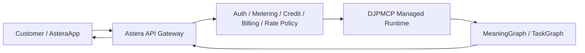
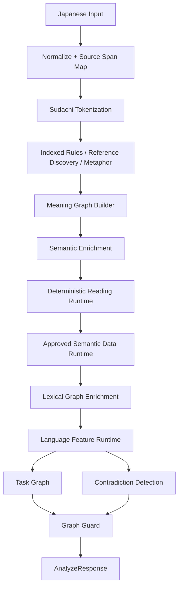

# Deterministic Japanese Parser MCP

<p align="center">
  <strong>A deterministic MCP server that turns Japanese lexical meaning, sentence structure, semantic scope, reference, and discourse relations into reproducible machine structures without an LLM</strong>
</p>

<p align="center">
  <a href="README.md">日本語</a> ｜ <strong>English</strong>
</p>

<p align="center">
  <a href="https://github.com/seigo-gace/Deterministic-Japanese-Parser-MCP/actions/workflows/ci.yml"></a>
</p>

## Overview

Deterministic Japanese Parser MCP (DJPMCP) reads Japanese **before a generative model has to guess what the text means** and converts that reading into reusable, testable structures.

Its primary authority is the `MeaningGraph`. The parser preserves lexical candidates, entities, clauses, propositions, predicate-argument structure, negation, conditions, quantification, modality, attribution, reference resolution, discourse relations, and unresolved elements instead of reducing the input to a single intent label. When actionable instructions are present, the same reading can also produce a `TaskGraph` and an external-action safety decision.

DJPMCP does **not** generate answers. It also does not intentionally fill unresolved subjects, targets, word senses, or causal relations with unsupported guesses.

| Item | Current implementation |
|---|---|
| Version | `0.4.0` |
| MCP tool | `analyze_japanese` |
| MCP transports | stdio / Streamable HTTP |
| Parser REST API | `POST /v1/analyze` |
| Python API | `ParserEngine().analyze(AnalyzeRequest(...))` |
| Python | 3.10+ |
| Morphology | SudachiPy + SudachiDict Core |
| Runtime LLM | None |
| External dictionary API at runtime | None |
| Program license | MIT |

---

## Distribution model: public OSS and official hosted service

DJPMCP is designed for two delivery modes.

### Public OSS / self-host

The program code in this repository is distributed under the MIT License. Users may install and operate it on their own PC, server, container, or private network and may use the stdio MCP, Streamable HTTP, REST, or Python interfaces.

In a self-hosted deployment, infrastructure, authentication, scaling, monitoring, backups, availability, and operational support are the operator's responsibility. Third-party data may remain governed by its own source license.

### Astera hosted commercial service

The Project Owner also intends to operate DJPMCP as a managed runtime behind Astera Platform / AsteraApp and provide access as a commercial API.

The commercial value is not based on hiding the open parser core. It is based on operating the core as a managed platform with service-layer capabilities such as:

- customer accounts and authentication;
- API credential lifecycle;
- authorization;
- usage metering;
- credit and quota enforcement;
- billing and plan integration;
- rate limiting and abuse protection;
- tenant isolation;
- monitoring, rollout, and rollback;
- support and commercial terms;
- official Astera integration.

The repository endpoint `POST /v1/analyze` is a **parser-runtime interface**. It is not, by itself, the permanent customer-facing commercial API contract. A paid Astera API should place a platform gateway and commercial control plane in front of the parser runtime.



Customer-facing commercial URLs, pricing, plans, SLA, and service terms should be treated as authoritative only when published by the Astera service layer, not inferred from the parser repository version.

See:

- [`docs/COMMERCIAL_AND_DISTRIBUTION_MODEL.md`](docs/COMMERCIAL_AND_DISTRIBUTION_MODEL.md)
- [`docs/ASTERA_HOSTED_API_ARCHITECTURE.md`](docs/ASTERA_HOSTED_API_ARCHITECTURE.md)
- [`docs/PRODUCTION_HTTP_DEPLOYMENT.md`](docs/PRODUCTION_HTTP_DEPLOYMENT.md)

---

## What DJPMCP can do

### Meaning Graph

The parser can preserve:

- source-text and normalized-text mapping;
- tokens and lexical information;
- entities and mentions;
- clauses and propositions;
- sense candidates and confidence;
- predicate-argument structure;
- dependency relations;
- negation, condition, quantity, degree, tense, aspect, voice, and modality scope;
- quotation, hearsay, and attribution;
- anaphora, demonstratives, ellipsis, and conversation context;
- causal, contrastive, sequential, purpose, and other discourse relations;
- ambiguity, missing information, contradictions, and unsupported elements;
- `semantic_hash` for the graph.

### Reading runtime

`meaning_graph.reading_analysis` exposes structures such as:

- `predicate_frames`;
- `dependency_arcs`;
- `scope_operators`;
- `attribution_frames`;
- `discourse_relations`;
- unresolved reading elements.

### Task Graph and fail-closed external action

When the input contains actionable instructions, DJPMCP may construct a `TaskGraph` and evaluate whether an external action may proceed.

Typical blocking conditions include:

- unresolved targets;
- unresolved references;
- material semantic ambiguity;
- conflicts with `protected_elements`;
- contradictions;
- unsupported elements relevant to execution;
- deadline overruns;
- ambiguous action/social language features.

When blocked, the response exposes `execution_allowed=false` and `blocked_reasons`.

DJPMCP itself does not operate external services. The caller remains responsible for real execution.

---

## Parser architecture



The central implementation is `ParserEngine.analyze()`. stdio MCP, Streamable HTTP MCP, REST, and Python interfaces all use the same engine and Pydantic request/response contract.

---

## Quick start

### Linux / macOS

```bash
git clone https://github.com/seigo-gace/Deterministic-Japanese-Parser-MCP.git
cd Deterministic-Japanese-Parser-MCP
python -m venv .venv
. .venv/bin/activate
python -m pip install --upgrade pip
pip install -e .
djpmcp-validate
```

### Windows PowerShell

```powershell
git clone https://github.com/seigo-gace/Deterministic-Japanese-Parser-MCP.git
cd Deterministic-Japanese-Parser-MCP
python -m venv .venv
.\.venv\Scripts\Activate.ps1
python -m pip install --upgrade pip
pip install -e .
djpmcp-validate
```

For development and the full test suite:

```bash
pip install -e ".[dev]"
```

---

## MCP over stdio

The installed server entrypoint is:

```bash
djpmcp
```

Example MCP client configuration:

```json
{
  "mcpServers": {
    "deterministic-japanese-parser": {
      "command": "/absolute/path/Deterministic-Japanese-Parser-MCP/.venv/bin/djpmcp"
    }
  }
}
```

On Windows, use a path such as:

```text
C:\path\Deterministic-Japanese-Parser-MCP\.venv\Scripts\djpmcp.exe
```

The server performs prewarm before entering the serving loop so that Sudachi lazy initialization, schemas, rule indexes, and representative parser paths are prepared outside the runtime deadline.

---

## MCP over Streamable HTTP

The HTTP entrypoint is:

```bash
djpmcp-http
```

Set an API key:

```bash
export DJPMCP_HTTP_API_KEY='replace-with-a-long-random-secret'
djpmcp-http
```

Defaults:

```text
Host: 127.0.0.1
Port: 8765
MCP endpoint: /mcp
Parser REST endpoint: /v1/analyze
Health: /healthz
Readiness: /readyz
```

Protected endpoints accept either:

```http
Authorization: Bearer <DJPMCP_HTTP_API_KEY>
```

or:

```http
X-API-Key: <DJPMCP_HTTP_API_KEY>
```

`/healthz` and `/readyz` are public. The HTTP runtime also provides DNS-rebinding protection, allowed-host/origin controls, request-body limits, JSON content-type validation, and stateless Streamable HTTP MCP handling.

For production boundaries, see [`docs/PRODUCTION_HTTP_DEPLOYMENT.md`](docs/PRODUCTION_HTTP_DEPLOYMENT.md).

---

## Parser REST API

### `POST /v1/analyze`

```bash
curl -X POST http://127.0.0.1:8765/v1/analyze \
  -H 'Authorization: Bearer YOUR_API_KEY' \
  -H 'Content-Type: application/json' \
  -d '{
    "original_text": "UIは維持する。APIだけ変更しろ。",
    "protected_elements": ["UI"],
    "execution_mode": "external_action",
    "analysis_depth": "auto",
    "deadline_ms": 50
  }'
```

This is the parser runtime API, not the complete paid Astera customer API.

---

## `analyze_japanese` input

| Field | Required | Default | Description |
|---|---:|---|---|
| `original_text` | Yes | — | Japanese text to analyze; must not be empty |
| `conversation_context` | No | `[]` | Earlier utterances used for context/reference resolution |
| `known_entities` | No | `[]` | Known people, objects, organizations, or targets |
| `protected_elements` | No | `[]` | Targets that must not be changed |
| `social_context` | No | empty model | Speaker/addressee/social context |
| `discourse_state` | No | `{}` | Caller-maintained discourse state |
| `execution_mode` | No | `analysis` | `analysis` / `comparison` / `planning` / `external_action` |
| `analysis_depth` | No | `auto` | `auto` / `fast` / `deep` |
| `deadline_ms` | No | `50` | 1–60,000ms, clamped to the configured hard deadline during execution |

The MCP tool advertises `AnalyzeRequest.model_json_schema()` and `AnalyzeResponse.model_json_schema()` as its input and output contracts.

The successful MCP result includes both:

1. complete `structuredContent` containing the `AnalyzeResponse`;
2. compact text content containing status, execution permission, graph counts, task count, and semantic hash.

---

## Python API

```python
from deterministic_japanese_parser_mcp import AnalyzeRequest, ParserEngine

response = ParserEngine().analyze(
    AnalyzeRequest(
        original_text="UIは維持する。APIだけ変更しろ。",
        protected_elements=["UI"],
        execution_mode="external_action",
        deadline_ms=50,
    )
)

print(response.meaning_graph)
print(response.task_graph)
print(response.execution_allowed)
```

`LowLatencyClientSession` is also exported for schema-safe low-latency MCP clients.

---

## Runtime configuration

Important parser settings include:

```text
DJPMCP_MAX_INPUT_LENGTH=20000
DJPMCP_MAX_CONTEXT_ITEMS=20
DJPMCP_MAX_CANDIDATES=8
DJPMCP_REGEX_TIMEOUT_MS=25
DJPMCP_TARGET_LATENCY_MS=10
DJPMCP_HARD_DEADLINE_MS=50
DJPMCP_MAX_GRAPH_NODES=512
DJPMCP_MAX_SCOPE_EDGES=1024
DJPMCP_LOG_PATH=...
DJPMCP_SYSTEM_DICT_DIR=...
DJPMCP_USER_DICT_DIR=...
DJPMCP_SEMANTIC_DATA_RUNTIME_DIR=...
```

Important HTTP settings include:

```text
DJPMCP_HTTP_HOST=127.0.0.1
DJPMCP_HTTP_PORT=8765
DJPMCP_HTTP_WORKERS=1
DJPMCP_HTTP_API_KEY=...
DJPMCP_HTTP_ALLOW_UNAUTHENTICATED=0
DJPMCP_HTTP_MAX_BODY_BYTES=1048576
DJPMCP_HTTP_ALLOWED_ORIGINS=...
DJPMCP_HTTP_ALLOWED_HOSTS=...
```

In the Astera commercial platform, customer credentials should not be reused as the internal parser runtime key.

---

## Dictionary and runtime data

The repository separates authored dictionaries, imported lexical data, public views, runtime projections, and compiled assets rather than treating one file as the authority for every layer.

The semantic runtime root resolves in this order:

1. `DJPMCP_SEMANTIC_DATA_RUNTIME_DIR` when explicitly set;
2. `compiled/canonical_dictionary_runtime` when present;
3. `compiled/semantic_data`.

The internal canonical master dictionary is intentionally not packaged in the default public wheel. Publicly redistributable views and runtime projections remain separate.

See:

- [`docs/LANGUAGE_DATA_RUNTIME.md`](docs/LANGUAGE_DATA_RUNTIME.md)
- [`docs/OPEN_DICTIONARY_SUPPLY_CHAIN.md`](docs/OPEN_DICTIONARY_SUPPLY_CHAIN.md)
- [`docs/DIRECT_FINAL_RUNTIME_DEPLOYMENT.md`](docs/DIRECT_FINAL_RUNTIME_DEPLOYMENT.md)
- [`NOTICE.md`](NOTICE.md)

---

## Validation and performance contracts

CI runs on Python 3.10 and 3.12 and includes, among other gates:

- deployment preflight;
- lexicon provenance and license validation;
- dictionary and Gold validation;
- supported semantic quality contract;
- independent semantic holdout contract;
- unit/importer/supply-chain/MCP stdio E2E tests;
- benchmark regression checks;
- 10ms target and 20x dictionary performance contract;
- Astera call-through 10ms target / 50ms hard-limit contract;
- Python compile validation;
- preserved evidence artifacts.

Representative local checks:

```bash
pip install -e ".[dev]"
python scripts/preflight.py
python tools/lexicon_validator.py
python tools/validator.py
python scripts/semantic_quality_contract.py --check
python scripts/semantic_holdout_contract.py --check
pytest
python scripts/benchmark.py --check --rounds 50
python scripts/performance_contract.py --check --rounds 50 --stdio-rounds 30 --scale 20 --max-ready-ms 10
python scripts/astera_latency_contract.py --check --rounds 50 --stdio-rounds 30 --target-ms 10 --hard-ms 50
```

The 10ms and 50ms values are performance contract targets/gates, not a claim that every machine and every input always completes in the same wall-clock time.

---

## Status model

- `COMPLETE` — no material unresolved element, contradiction, unsupported item, or timeout remains.
- `PARTIAL` — useful analysis exists, but unresolved or incomplete elements remain.
- `FAILED` — the parser could not construct a usable meaning result.

For `external_action`, callers should always inspect both `execution_allowed` and `blocked_reasons`.

---

## Limitations

DJPMCP may still return `PARTIAL`, `AMBIGUOUS`, or `UNSUPPORTED` for cases such as:

- word senses without enough dictionary/rule/semantic evidence;
- long-distance ellipsis and anaphora;
- implications requiring broad world knowledge;
- advanced irony, new slang, or newly coined words;
- social relations that cannot be resolved from supplied context;
- sentences with multiple valid scope interpretations;
- inputs that exceed graph or deadline limits.

The design goal is to keep unresolved meaning explicit rather than pretending it was understood.

---

## Documentation map

### Distribution / commercial / production

- [`docs/COMMERCIAL_AND_DISTRIBUTION_MODEL.md`](docs/COMMERCIAL_AND_DISTRIBUTION_MODEL.md)
- [`docs/ASTERA_HOSTED_API_ARCHITECTURE.md`](docs/ASTERA_HOSTED_API_ARCHITECTURE.md)
- [`docs/PRODUCTION_HTTP_DEPLOYMENT.md`](docs/PRODUCTION_HTTP_DEPLOYMENT.md)
- [`docs/DIRECT_FINAL_RUNTIME_DEPLOYMENT.md`](docs/DIRECT_FINAL_RUNTIME_DEPLOYMENT.md)

### Parser and semantic contracts

- [`docs/JAPANESE_READING_CONTRACT.md`](docs/JAPANESE_READING_CONTRACT.md)
- [`docs/SEMANTIC_QUALITY_CONTRACT.md`](docs/SEMANTIC_QUALITY_CONTRACT.md)
- [`docs/LANGUAGE_DATA_RUNTIME.md`](docs/LANGUAGE_DATA_RUNTIME.md)
- [`docs/OPEN_LEXICON_ACCURACY.md`](docs/OPEN_LEXICON_ACCURACY.md)
- [`docs/PERFORMANCE_AND_RELEASE_CONTRACT.md`](docs/PERFORMANCE_AND_RELEASE_CONTRACT.md)

### Project policy

- [`LICENSE`](LICENSE)
- [`NOTICE.md`](NOTICE.md)
- [`GOVERNANCE.md`](GOVERNANCE.md)
- [`TRADEMARK.md`](TRADEMARK.md)
- [`SECURITY.md`](SECURITY.md)
- [`CONTRIBUTING.md`](CONTRIBUTING.md)

---

## License, data, commercial terms, and brand

Program code is licensed under MIT. Third-party dictionary and language data remain governed by their recorded source licenses. Project Marks, including DJPMCP/Shiori and the separate Astera brand, are governed independently from the program-code license.

The Project Owner may provide an official hosted service under separate pricing, SLA, support, and service terms. Those hosted-service terms do not retroactively revoke program-code rights already granted by the repository's MIT License.

See [`LICENSE`](LICENSE), [`NOTICE.md`](NOTICE.md), [`GOVERNANCE.md`](GOVERNANCE.md), [`TRADEMARK.md`](TRADEMARK.md), and [`docs/COMMERCIAL_AND_DISTRIBUTION_MODEL.md`](docs/COMMERCIAL_AND_DISTRIBUTION_MODEL.md).
