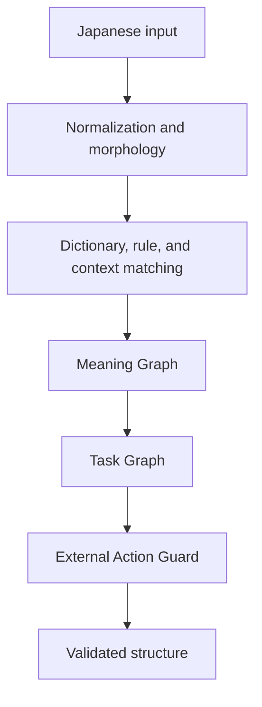

# Deterministic Japanese Parser MCP

<p align="center">
  <strong>An MCP server that turns Japanese instructions, conditions, prohibitions, exceptions, and references into reproducible structures without generative AI</strong>
</p>

<p align="center">
  <a href="README.md">日本語</a> ｜ <strong>English</strong>
</p>

<p align="center">
  <a href="https://github.com/seigo-gace/Deterministic-Japanese-Parser-MCP/actions/workflows/ci.yml"></a>
</p>

| Item | Value |
|---|---|
| MCP tool | `analyze_japanese` |
| Runtime model | Non-AI, non-generative, deterministic |
| Interfaces | MCP stdio and Python API |
| Supported environment | Python 3.10+ |
| External connections | No AI API or dictionary API calls at runtime |
| Program license | MIT |

[Quick start](#quick-start) ｜ [Connect an MCP client](#connect-an-mcp-client) ｜ [Input and output](#input-and-output) ｜ [Dictionary data](#dictionary-data) ｜ [Validation](#validation) ｜ [Limitations](#limitations)

## What this MCP does

This MCP does not generate an answer. It analyzes Japanese requests and descriptions and returns structures that downstream systems can use for decisions:

- who requests what and against which target;
- conditions, exceptions, prohibitions, preservation, priorities, sequence, and dependencies;
- quotation, questions, hypotheses, reported speech, corrections, and withdrawal;
- omitted targets, unresolved references, ambiguity, and contradictions;
- candidate actions and the reasons they may proceed or must remain blocked.

For example, from `UIは維持する。APIだけ変更しろ。` (“Preserve the UI. Change only the API.”), it separates `UI` as a protected target from `API` as the modification target, then returns a Meaning Graph, a Task Graph, and an external-action safety decision.

### What it does and does not do

| It does | It does not |
|---|---|
| Convert Japanese into a typed Meaning Graph | Generate answers or conversation text |
| Organize tasks and constraints into a Task Graph | Operate external services directly |
| Preserve the scope of conditions, negation, quotation, and questions | Invent unsupported meaning |
| Block external action on unresolved, contradictory, or timed-out analysis | Call an LLM or external dictionary API at runtime |
| Produce the same semantic hash from the same input conditions | Claim human-level understanding of all Japanese |

## Quick start

### Linux and macOS

```bash
git clone https://github.com/seigo-gace/Deterministic-Japanese-Parser-MCP.git
cd Deterministic-Japanese-Parser-MCP
python -m venv .venv
. .venv/bin/activate
pip install -e .
djpmcp-validate
```

### Windows PowerShell

```powershell
git clone https://github.com/seigo-gace/Deterministic-Japanese-Parser-MCP.git
cd Deterministic-Japanese-Parser-MCP
python -m venv .venv
.\.venv\Scripts\Activate.ps1
pip install -e .
djpmcp-validate
```

Use `pip install -e ".[dev]"` only when you need the development and full-test dependencies.

## Connect an MCP client

Add the server to your MCP client's configuration. Using the absolute path to the `djpmcp` executable inside the virtual environment is the most reliable option.

```json
{
  "mcpServers": {
    "deterministic-japanese-parser": {
      "command": "/absolute/path/Deterministic-Japanese-Parser-MCP/.venv/bin/djpmcp"
    }
  }
}
```

On Windows, use a path such as `C:\\path\\Deterministic-Japanese-Parser-MCP\\.venv\\Scripts\\djpmcp.exe`. After the client connects, call the `analyze_japanese` tool.

## Input and output

### `analyze_japanese` input

| Field | Required | Default | Description |
|---|---:|---|---|
| `original_text` | Yes | — | Japanese text to analyze; it must not be empty |
| `conversation_context` | No | `[]` | Earlier utterances used for reference resolution |
| `known_entities` | No | `[]` | Known people, objects, organizations, or targets |
| `protected_elements` | No | `[]` | Targets that must not be changed |
| `social_context` | No | Empty | Speaker, addressee, relationship, setting, and formality |
| `discourse_state` | No | `{}` | Discourse state maintained by the caller |
| `execution_mode` | No | `analysis` | `analysis` / `comparison` / `planning` / `external_action` |
| `analysis_depth` | No | `auto` | `auto` / `fast` / `deep` |
| `deadline_ms` | No | `50` | 1 to 60,000 milliseconds |

Example MCP tool arguments:

```json
{
  "original_text": "UIは維持する。APIだけ変更しろ。",
  "protected_elements": ["UI"],
  "execution_mode": "external_action",
  "analysis_depth": "auto",
  "deadline_ms": 50
}
```

### Main output fields

| Output | Contents |
|---|---|
| `overall_status` | Overall result: `COMPLETE` / `PARTIAL` / `FAILED` |
| `meaning_graph` | Entities, clauses, propositions, lexical candidates, scope, and unresolved items |
| `task_graph` | Tasks, dependencies, preservation, prohibitions, conditions, and verification criteria |
| `execution_allowed` | Whether an external action may proceed |
| `blocked_reasons` | Reasons the action was blocked |
| `ambiguities` / `contradictions` | Ambiguity and conflicting requirements |
| `missing_information` / `unsupported_elements` | Missing information and unsupported elements |
| `versions` | Dictionary, rule, and graph versions |
| `metrics` | Timing, deadline, and other runtime information |

The same input, conversation context, dictionaries, and rule versions produce the same `meaning_graph.semantic_hash`.

### Python API

```python
from deterministic_japanese_parser_mcp import AnalyzeRequest, ParserEngine

response = ParserEngine().analyze(
    AnalyzeRequest(
        original_text="UIは維持する。APIだけ変更しろ。",
        protected_elements=["UI"],
        execution_mode="external_action",
        deadline_ms=50,
    )
)

print(response.meaning_graph)
print(response.task_graph)
print(response.execution_allowed)
print(response.blocked_reasons)
```

## Processing flow



The parser preserves original text positions while combining Sudachi morphology, fixed dictionaries, prebuilt rule indexes, deterministic grammar processing, and scope, reference, and contradiction detection. Material unresolved items remain explicit instead of being guessed.

## Safety

The following are not treated directly as executable actions:

- quoted or reported commands: “I was told to delete it”;
- questions: “Should this be deleted?”;
- hypotheses: “Delete it if it is unnecessary”;
- instructions with an unresolved target: “Change that”;
- instructions that conflict with a preservation requirement;
- input whose critical meaning cannot be resolved before the deadline.

When an external action cannot be allowed, the response includes `execution_allowed=false` and explanatory `blocked_reasons`. The caller remains responsible for deciding whether to perform any real-world operation.

## Dictionary data

### Data used by the default runtime

| Data | Count | Runtime role |
|---|---:|---|
| Open Lexicon | 120,000 | Lexical identity such as surface, reading, and part of speech; meanings are not auto-approved |
| Metaphor, idiom, and pragmatic expressions | 452 | Fixed-expression interpretation |
| Deterministic intent rules | 339 | Requests, prohibitions, conditions, and related decisions |
| Intent types | 21 | Classification of detected intent |
| Synonym groups | 100 | Surface and semantic normalization |
| Task Templates | 63 | Task structure generation |
| Workflows | 42 | Sequence and dependency generation |
| Gold Cases | 649 | Regression and quality validation |

The Open Lexicon contains JMdict-derived lexical information split into twelve shards for lexical identification only. The runtime loads the shards as one dictionary and retains all homograph candidates instead of collapsing them. This does not imply complete semantic, pragmatic, or executable-intent understanding of all 120,000 records.

For the processing pipeline, the 120,000 records already enriched with JMdict meaning candidates by PR #26 are combined with approximately 5,000 special-vocabulary, dialect, onomatopoeia, and youth-language records in one digest-locked 125,000-record Review Queue. The pipeline neither prioritizes only the 5,000 records nor excludes the 120,000 records from review. Unapproved meaning candidates are never loaded by the default runtime.

See [`docs/OPEN_LEXICON_ACCURACY.md`](docs/OPEN_LEXICON_ACCURACY.md) for reconstruction, index, and ambiguity-retention evidence for the 120,000-record lexicon.

### Automated dictionary processing and integration

New data passes through the same non-AI pipeline regardless of its source.

| Input type | Ingest path | Separation model |
|---|---|---|
| Open Lexicon — 120,000 records | `dictionaries/system/lexicon.d/` | Preserve JMdict meaning candidates and enter the common Review Queue |
| Special and contextual vocabulary — 5,000 records | `research/context_collection/expansion_v3/` | Adapt to the common schema and enter the same Review Queue |
| Domain dictionaries | `dictionaries/domain_packs/<domain>/` | Physically separated from core data |
| User data | `dictionaries/user_packs/<pack>/` | Coexists without silently replacing project data |

The pipeline performs these stages:

1. adapt each source to the common schema and apply NFKC normalization;
2. organize readings, part of speech, morphology, and spelling variants;
3. validate source, version, license, and SHA-256 evidence;
4. detect duplicates, homographs, collisions, and possible relations to existing data;
5. place all 125,000 records in one Review Queue, then split it into review batches of no more than 20 records;
6. judge polarity, intensity from 0.0 to 1.0, required and excluded contexts, task candidates, and External Action Risk for every record;
7. write judgments to `research/semantic_decisions/decision_ledger.jsonl` and apply only explicit approvals;
8. compile approved scopes into separate `core`, `domains`, and `user` packs;
9. run Gold, independent holdout, safety, performance, and offline-wheel gates.

Approval is field-scoped rather than one Boolean for the entire record: `lexical`, `semantic`, `pragmatic`, `task`, and `external_action`. The compiler removes fields from every unapproved scope.

The current pipeline does not use an LLM API. The GPT app acts as the external operator: it reads the 125,000-record review workload in order and writes user-directed judgments to the Decision Ledger. It preserves the existing JMdict meanings for the 120,000 records and adds only the missing polarity, intensity, context, task-candidate, and External Action Risk judgments. The pipeline does not make judgments or approve records on its own. When review remains, GitHub Actions preserves the evidence and stops the publication gate with `REVIEW_REQUIRED`.

Example commands:

```bash
python tools/unified_semantic_data_pipeline.py --compile-approved
python tools/unified_semantic_data_pipeline.py --check
python tools/unified_semantic_data_pipeline.py --require-review-complete
```

See [`docs/UNIFIED_SEMANTIC_DATA_PIPELINE.md`](docs/UNIFIED_SEMANTIC_DATA_PIPELINE.md) for the schemas, review contract, generated artifacts, and workflow details.

## Validation

Install the development dependencies before running the full suite.

```bash
pip install -e ".[dev]"
python tools/lexicon_validator.py
python tools/validator.py
pytest
python scripts/benchmark.py --check
python scripts/performance_contract.py --check --max-ready-ms 10
python scripts/astera_latency_contract.py --check --target-ms 10 --hard-ms 50
python -m compileall -q src tools scripts tests
```

CI validates dictionary integrity, Meaning Graph and Task Graph behavior, quotation, question, negation, hypothesis, and reference safety, MCP stdio, offline wheels, and performance at twenty times the dictionary scale.

| Performance boundary | Contract |
|---|---:|
| Optimized resident processing goal | 5 ms or less |
| Normal call-through target | p95 at 10 ms or less |
| Absolute hard limit | 50 ms or less |
| Not completed within the limit | Return `TIMEOUT` and block external action |

See [`docs/SEMANTIC_QUALITY_CONTRACT.md`](docs/SEMANTIC_QUALITY_CONTRACT.md) for quality gates and [`docs/PERFORMANCE_AND_RELEASE_CONTRACT.md`](docs/PERFORMANCE_AND_RELEASE_CONTRACT.md) for performance gates.

## Limitations

- The parser cannot fully handle irony, broad world knowledge, complex ellipsis, or long multi-paragraph discourse.
- Expressions that strongly depend on region, generation, or community remain unresolved when evidence is insufficient.
- The 120,000-record Open Lexicon provides lexical identity, not complete semantic understanding.
- `execution_allowed` is a parser safety decision. It does not replace authentication, authorization, business policy, or legal judgment.
- This MCP does not execute external actions. The caller remains responsible for execution.

## Documentation and support

| Purpose | Document or channel |
|---|---|
| Documentation index | [`docs/README.md`](docs/README.md) |
| Usage, installation, and unconfirmed parser findings | [GitHub Discussions](https://github.com/seigo-gace/Deterministic-Japanese-Parser-MCP/discussions) |
| Reproducible defects | [GitHub Issues](https://github.com/seigo-gace/Deterministic-Japanese-Parser-MCP/issues/new?template=bug_report.yml) |
| Security reports | [`SECURITY.md`](SECURITY.md) |
| Validation participation | [`VALIDATION.md`](VALIDATION.md) |
| Contributions | [`CONTRIBUTING.md`](CONTRIBUTING.md) |
| Change history | [`CHANGELOG.md`](CHANGELOG.md) |

## License and provenance

Program code is licensed under MIT. See [`LICENSE`](LICENSE).

Data derived from external dictionaries remains governed by the source license recorded on each record and in its source manifest. The current JMdict-derived Open Lexicon is CC BY-SA 4.0 and retains attribution to the Electronic Dictionary Research and Development Group on each record. See [`NOTICE.md`](NOTICE.md) for third-party dependencies and dictionary-data notices.

<!-- project-control-en:start -->
See [`GOVERNANCE.md`](GOVERNANCE.md) and [`TRADEMARK.md`](TRADEMARK.md) for project governance and use of names and logos.
<!-- project-control-en:end -->
