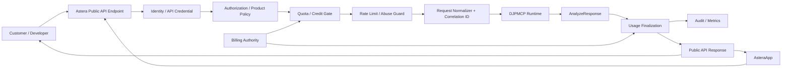

# Astera Hosted API Architecture / Astera商用Hosted API構成

Version 1.0 — 2026-09-26

## 目的

この文書は、Deterministic Japanese Parser MCP（DJPMCP）をProject Owner管理Server上で稼働させ、AsteraApp / Astera Platformから**有料APIとして提供する場合の責務分離**を定義します。

この文書が定義するのは公開可能なArchitecture Boundaryです。実際のCustomer-facing URL、料金、Plan、SLA、Production Secret、Private Infrastructure情報はこのRepositoryではAuthorityにしません。

前提となる配布・商用モデルは[`COMMERCIAL_AND_DISTRIBUTION_MODEL.md`](COMMERCIAL_AND_DISTRIBUTION_MODEL.md)を参照してください。

---

## 1. 設計原則

商用Platform化で最も重要なのは、**Parser Runtimeへ課金・Account・Tenant管理まで詰め込まないこと**です。

責務は次の二層に分離します。

### Parser Data Plane

DJPMCPが担当します。

- Japanese input normalization
- Tokenization
- Lexical / semantic analysis
- Meaning Graph
- Reading Analysis
- Task Graph
- Contradiction detection
- External-action parsing guard
- Semantic hash
- Parser metrics

### Commercial Control Plane

Astera Platformが担当します。

- Customer identity
- Authentication
- Authorization
- API credential lifecycle
- Product / plan selection
- Usage metering
- Credit / quota
- Billing
- Rate limiting
- Abuse control
- Tenant isolation
- Public API versioning
- Request correlation
- Support entitlement
- Commercial audit

Parser Data Planeは「誰がいくら払ったか」を知る必要がなく、Commercial Control Planeは「日本語の意味をどう解析するか」を再実装しません。

---

## 2. 推奨Architecture



### 境界上の重要点

1. Customer RequestはDJPMCPへ直接到達させず、Commercial Gatewayを通す。
2. Customer API CredentialをDJPMCP内部へ保存しない。
3. Parser内部ErrorとCustomer-facing Error Contractを分離する。
4. Parser versionとPublic API versionを同一視しない。
5. 課金確定とParser結果の相関にはPlatform側Request IDを使用する。

---

## 3. Request Flow

推奨する一回のRequest Flowは次です。

1. RequestをAstera Public APIで受信。
2. Credential / SessionからCustomer Identityを確定。
3. Product・Plan・ScopeをAuthorization。
4. Credit / Quota / Rate limitをPre-check。
5. Platform Request IDを採番。
6. Customer-facing payloadをParser `AnalyzeRequest`へ変換。
7. Internal NetworkからDJPMCP RuntimeへCall。
8. `AnalyzeResponse`を受領。
9. `overall_status`、runtime version、semantic hash、処理量等をUsage Evidenceへ関連付ける。
10. Billing / Credit Authorityの規則に従いUsageを確定。
11. Customer-facing Response Schemaへ投影。
12. Audit / metricsを記録。

Parser失敗時の課金ルールはBilling Product Policyの責務です。Parser Coreに金額ロジックを埋め込みません。

---

## 4. Public API ContractとInternal Parser Contract

### Internal Parser Contract

現行RepositoryのParser interface：

- MCP Tool: `analyze_japanese`
- Streamable HTTP MCP: `/mcp`
- REST: `POST /v1/analyze`
- Python: `ParserEngine().analyze(...)`

これはParser Runtime Contractです。

### Customer-facing Commercial Contract

Astera Hosted APIでは、Internal Parser Contractをそのまま永久互換のPublic Product Contractにする必要はありません。

推奨：

```text
Customer API Version
        ↓ adapter
Platform Product Contract
        ↓ adapter
DJPMCP AnalyzeRequest / AnalyzeResponse
```

このAdapter Boundaryにより、Parser内部Schemaを改善しても、Customer向けAPIを必要に応じて安定維持できます。

---

## 5. 認証・API Keyの責務

Repositoryの`djpmcp-http`には単一API KeyによるRuntime保護があります。これはSelf-hostや内部Service保護には利用できますが、**有料Multi-customer PlatformのCustomer Credential Authorityとしては別レイヤーに置く**べきです。

理由：

- CustomerごとのKey lifecycleが必要
- Key revoke / rotateが必要
- Plan / tenant / scope紐付けが必要
- Usage ledgerとの関連付けが必要
- Commercial abuse controlが必要

したがって、Productionでは概念的に次の二段を推奨します。

```text
Customer Credential
   ↓
Astera Gateway
   ↓ internal service authentication
DJPMCP Runtime
```

Customer用KeyとRuntime内部Keyを同一にしません。

---

## 6. Usage Metering

有料APIではRequest Countだけではなく、**何を課金Evidenceにするか**をPlatform側で固定する必要があります。

候補：

- accepted request count
- completed analysis count
- input character tier
- product-specific operation unit
- credit unit

このRepositoryでは料金単位を決めません。料金ロジックをParserへ持たせると、OSS CoreとCommercial Productが不要に結合するためです。

ただしEvidenceとして、Platform側は最低限次を関連付けられる構造にします。

```text
platform_request_id
customer_id / tenant_id (Platform only)
product_api_version
parser_version
request_received_at
result_status
semantic_hash
usage_unit
billing_result
```

個人情報やCustomer SecretをParser diagnostic logへ混入させないことを推奨します。

---

## 7. Credit / Billing Gate

Credit制の場合は、次の二段階を分離します。

### Pre-execution Gate

- Subscription/Account status
- 利用権限
- Credit残高またはAllowance
- Rate/Quota

### Finalization

- Parser Callが実際に受理されたか
- Product Policy上課金対象になったか
- Retry / duplicateではないか
- Request IDが二重計上されていないか

決済ProviderのWebhookやSubscription AuthorityはAstera Billing側に置き、DJPMCPはBilling Providerへ接続しません。

---

## 8. RetryとIdempotency

Commercial API Gatewayでは、Network Retryによる二重課金を防ぐ必要があります。

推奨：

- Customer Requestにidempotency keyを許可またはPlatformでRequest IDを固定
- 同じCustomer/Operationに対する重複RequestをPlatform側で判定
- ParserはPureに近い決定論的Data Planeとして扱う
- Billing FinalizationはRequest ID単位で一度だけ確定

DJPMCPの`semantic_hash`は意味結果の同一性確認に使えますが、**Billing idempotency keyの代替にはしません**。同じ意味の別Requestまで一つの課金単位と誤認する可能性があるためです。

---

## 9. Logging / Evidence

Commercial Platform側のOperational Evidenceは、Parser diagnostic logと分離します。

### Parser側

- overall status
- semantic hash
- ambiguity / contradiction / timeout
- parser metrics
- parser version

### Platform側

- request ID
- tenant/customer authority
- auth result
- quota result
- billing/credit event
- response status
- latency at gateway
- parser version correlation

Security上、Raw API credentialをLogへ保存しません。

---

## 10. Scaling

DJPMCP RuntimeはStateless HTTP Sessionとして利用できるため、Commercial Gatewayから複数Runtime Replicaへ分散する構成と相性があります。

ただし、次はPlatform側で管理します。

- health/readiness based routing
- concurrency limit
- queue/backpressure
- autoscaling or fixed capacity
- deployment rollout
- version pinning
- rollback

`/healthz`と`/readyz`の詳細は[`PRODUCTION_HTTP_DEPLOYMENT.md`](PRODUCTION_HTTP_DEPLOYMENT.md)を参照してください。

---

## 11. Version Strategy

最低でも三種類を分離します。

| Version | Authority | 目的 |
|---|---|---|
| Parser version | DJPMCP | Engine behavior |
| Runtime data version | DJPMCP assets | Dictionary / semantic data |
| Commercial API version | Astera Platform | Customer compatibility |

CustomerへParser internal versionを返すことはEvidence上有用ですが、Public API compatibilityはCommercial API Versionで判断します。

---

## 12. Security Boundary

Internet-facingで必須となる対策はParser HTTP Serverだけでは完結しません。

Astera Gateway側で追加すべき責務：

- Customer authentication
- per-tenant rate limit
- credential rotation/revocation
- DDoS / abuse protection
- request size policy
- endpoint-level authorization
- billing fraud protection
- audit trail
- secret management

DJPMCP Runtimeは原則としてInternetから直接到達できない内部Serviceとして置く構成を推奨します。

---

## 13. Data Retention

Parser CoreはCustomerのCommercial retention policyを決定しません。

Astera Platformで次を明文化します。

- Request bodyを保存するか
- Response bodyを保存するか
- Usage metadataのみ保存するか
- 保存期間
- Customer deletion時の扱い
- Security incident時のEvidence retention

必要以上のInput本文保存を避け、Meteringに必要なMetadataとParser Evidenceを分離できる設計を推奨します。

---

## 14. 現在実装済みとCommercial Platform実装を混同しない

現Repositoryで確認できるもの：

- Parser Engine
- MCP stdio
- Streamable HTTP MCP
- REST `/v1/analyze`
- API Key middleware
- request body limit
- host/origin protection
- health/readiness
- Parser validation/performance contracts

一方、次は**このRepository単体が提供済みだとREADMEで主張しません**。

- Astera customer registration
- Paid customer API key portal
- Metering ledger
- Credit consumption
- Commercial rate plans
- Billing integration
- Customer SLA
- Public commercial endpoint

これらはAsteraApp / Astera Platform側の実装・検証状態をAuthorityとして公開すべき項目です。

---

## 15. 関連Document

- [`COMMERCIAL_AND_DISTRIBUTION_MODEL.md`](COMMERCIAL_AND_DISTRIBUTION_MODEL.md)
- [`PRODUCTION_HTTP_DEPLOYMENT.md`](PRODUCTION_HTTP_DEPLOYMENT.md)
- [`JAPANESE_READING_CONTRACT.md`](JAPANESE_READING_CONTRACT.md)
- [`DIRECT_FINAL_RUNTIME_DEPLOYMENT.md`](DIRECT_FINAL_RUNTIME_DEPLOYMENT.md)
- [`../GOVERNANCE.md`](../GOVERNANCE.md)
- [`../TRADEMARK.md`](../TRADEMARK.md)
