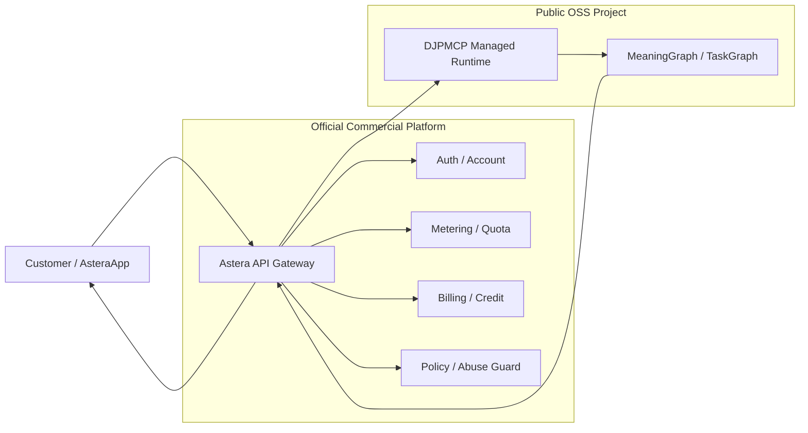

# Commercial and Distribution Model / 公開配布・商用提供モデル

Version 1.0 — 2026-09-26

## 目的

Deterministic Japanese Parser MCP（DJPMCP）は、**公開Open Source Softwareとして配布できるParser Core**と、Project Ownerが運営する**Official Hosted Commercial Service**の両方を前提にしています。

この文書は、Repositoryから入手して自分で実行する利用形態と、Astera Platform / AsteraAppからProject Owner運営ServerのRuntimeをAPIとして利用する商用形態を混同しないための公開境界を定義します。

この文書はRepositoryのMIT Licenseを変更するものではありません。Program Codeの権利は[`../LICENSE`](../LICENSE)、Third-party Dataは[`../NOTICE.md`](../NOTICE.md)、Project MarksとAstera Brandは[`../TRADEMARK.md`](../TRADEMARK.md)、Project Ownerの権限は[`../GOVERNANCE.md`](../GOVERNANCE.md)に従います。

---

## 1. 二つの提供形態

### A. Public OSS Distribution

GitHub RepositoryからSource Codeを取得し、利用者自身のPC、Server、Container、Private Networkなどで実行する形態です。

主な特徴：

- RepositoryのProgram CodeはMIT License
- SourceからのInstall、stdio MCP、Streamable HTTP、REST、Python APIを利用可能
- Self-host時のInfrastructure、Authentication、Availability、Scaling、Monitoring、Backup、Supportは利用者側の責務
- Repositoryに含まれるThird-party Dataは各Source LicenseとNoticeに従う
- Project MarksやAstera Brandの利用権はMIT Licenseには含まれない

OSS利用者が自分でServerへDeployすることや、MIT Licenseの範囲でProgram Codeを商用利用すること自体は妨げません。

### B. Official Hosted Commercial Service

Project Ownerが管理するServer Runtimeを、Astera Platform / AsteraApp等のOfficial Service Layerから提供する形態です。

この形態では、利用者がParserをInstall・Maintainする代わりに、運営側がRuntimeとService Layerを管理します。商用価値はSource Codeを隠すことではなく、次のManaged Capabilityをまとめて提供することにあります。

- Managed Parser Runtime
- Public API Gateway
- Account / API Credential management
- Authentication / Authorization
- Usage metering
- Rate / quota enforcement
- Billing / credit / plan integration
- Tenant boundary
- Abuse prevention
- Operational monitoring
- Version rollout / rollback
- Availability management
- Support and commercial terms
- Astera product integration

これらのService Layerは、公開Parser CoreのMIT Licenseとは別のサービス契約・利用条件・料金体系で提供できます。

---

## 2. 「OSS版」と「有料版」の関係

本Projectでは、公開Repositoryを機能を意図的に壊した「無料版」と位置付けません。

より正確な区分は次です。

| 区分 | Public OSS / Self-host | Official Hosted Commercial Service |
|---|---|---|
| Parser Core | 利用可能 | Managed Runtimeとして利用 |
| Install | 利用者 | 運営側 |
| Upgrade | 利用者 | 運営側 |
| Infrastructure | 利用者 | 運営側 |
| API Gateway | 利用者が構築 | Platformで提供 |
| Account/Auth | 利用者が構築 | Platformで提供 |
| Metering/Quota | 利用者が構築 | Platformで提供 |
| Billing | 利用者が構築 | Platformで提供 |
| Monitoring | 利用者 | 運営側 |
| SLA/Support | OSSとして保証なし | Commercial Termsで定義可能 |
| Astera Integration | 別途 | Official integrationとして提供可能 |

つまり、有料サービスの価値は**「同じCoreを使わせないこと」ではなく、「そのCoreを運用可能なPlatformとして提供すること」**です。

---

## 3. Repositoryに含まれるもの / 含まれないもの

### Public RepositoryのAuthority

このRepositoryは、次の公開仕様のAuthorityです。

- Parser Engine
- Meaning Graph / Task Graph schema
- `analyze_japanese` MCP Tool contract
- stdio MCP transport
- Streamable HTTP parser transport
- `POST /v1/analyze` engine-facing REST endpoint
- Dictionary / Semantic Runtime build and validation
- Performance / Quality / Safety contracts
- Public Docker and local deployment artifacts

### Commercial PlatformのAuthorityではないもの

このRepositoryのHTTP endpointが存在することは、それ自体でCustomer-facing paid APIのCommercial Contractを意味しません。

次はAstera Platform側の責務であり、**このRepositoryの公開Parser API Contractと分離**します。

- Customer account
- API key lifecycle for paid customers
- Subscription / credit / invoice / payment
- Per-customer usage ledger
- Public product endpoint/versioning policy
- Rate plan
- Quota plan
- Tenant policy
- Commercial logging/retention policy
- SLA
- Support entitlement
- Customer-facing Terms of Service
- Commercial privacy/data-processing terms

`/v1/analyze` はParser RuntimeのHTTP interfaceです。Asteraの有料Public APIを設計する際は、これをInternetへそのまま露出するのではなく、Platform Gatewayの内側に置くことを推奨します。

---

## 4. 推奨する商用境界

重要なのは、**Parser CoreとCommercial Control Planeを疎結合にすること**です。

Parser Coreは「日本語を決定論的に解析する」責務に集中し、Customer identity、料金、Credit、契約Planなどを認識しません。Commercial Platform側はParser内部の意味解析ロジックを持たず、認証・利用量・課金・運用を担当します。

この分離により、Self-host利用、Astera Hosted Service、将来のEnterprise Private Deploymentなどを同じParser Coreから派生できます。

---

## 5. Commercial APIで固定すべき原則

Official Hosted APIを提供する場合は、少なくとも次をParser Runtimeの外側で管理します。

1. **Identity** — 誰のRequestかをPlatformで確定する。
2. **Authorization** — 利用可能なProduct / Plan / Scopeを判定する。
3. **Metering** — Request、処理量、課金単位を改ざん不能な形で記録する。
4. **Quota** — Credit、Rate、Plan上限を実行前または確定可能な地点で評価する。
5. **Billing separation** — Parserは金額・決済状態を判断しない。
6. **Version boundary** — Customer-facing API versionとParser internal versionを分離する。
7. **Tenant isolation** — Customer ContextやCredentialを他Tenantへ混在させない。
8. **Fail closed** — Auth、Metering、Billing Authorityが不明なRequestを無料通過させない。
9. **Operational evidence** — request ID、runtime version、semantic hash、result statusを相関可能にする。
10. **No secret in repository** — Production credential、Commercial API key、Billing secretをPublic Repositoryへ保存しない。

---

## 6. Open Source Licenseと商用Serviceの関係

RepositoryのProgram CodeはMIT Licenseです。したがって、Repository利用者にはMIT Licenseが定める利用・改変・再配布・販売等の権利があります。

Project OwnerがOfficial Hosted Serviceを有料提供することは、このMIT Licenseと矛盾しません。一方、Hosted Serviceの利用条件、料金、SLA、Support、Astera integration等はService Contractとして別に定義できます。

重要な境界：

- MIT Licenseで既に付与されたProgram Codeの権利をHosted Service Termsで遡って取り消さない
- Third-party Data LicenseはMITへ吸収されない
- Astera / DJPMCPのBrand利用権はProgram Code Licenseとは別
- Official Serviceであることを名乗れる主体はGovernance / Trademark Policyに従う

詳細：

- [`../LICENSE`](../LICENSE)
- [`../NOTICE.md`](../NOTICE.md)
- [`../GOVERNANCE.md`](../GOVERNANCE.md)
- [`../TRADEMARK.md`](../TRADEMARK.md)

---

## 7. 将来の提供モデル

同じCoreから次のDelivery Modelを成立させられます。

### Self-host

利用者が自分でInstall・Deploy・Operate。

### Astera Hosted API

Astera PlatformからAPIとして利用。運営側がRuntime、Gateway、Billing、Monitoringを管理。

### Enterprise Private Deployment

Customer専用環境へDeployし、Commercial SupportやUpdate Contractを付与する形態。実際に提供する場合は別途契約を定義します。

### Internal Astera Integration

Astera製品内部の日本語解析レイヤーとして利用。Customer-facing APIと内部CallはGateway/Policyで分離します。

---

## 8. 公開Documentと非公開運用情報の境界

Public Repositoryへ記載してよいもの：

- Architecture
- Public interface
- Environment variable names
- Security design
- Self-host procedure
- Quality/performance contract
- Distribution model
- Commercial serviceの責務境界

Public Repositoryへ記載しないもの：

- Production secret
- Live API key
- Internal credential
- Private IP / privileged route
- Customer data
- Billing secret
- Infrastructure recovery secret
- Abuse detection thresholdのうち公開で回避可能になる機微情報

商用Serviceを説明するDocumentは、**使い方と責務境界は公開し、運用秘密は公開しない**ことを原則とします。

---

## 9. 関連Document

- [`ASTERA_HOSTED_API_ARCHITECTURE.md`](ASTERA_HOSTED_API_ARCHITECTURE.md) — Astera Hosted APIの責務・Data Flow・境界
- [`PRODUCTION_HTTP_DEPLOYMENT.md`](PRODUCTION_HTTP_DEPLOYMENT.md) — HTTP RuntimeをProductionへ配置するときの公開可能な安全要件
- [`DIRECT_FINAL_RUNTIME_DEPLOYMENT.md`](DIRECT_FINAL_RUNTIME_DEPLOYMENT.md) — 完成版Runtime bundleの投影
- [`JAPANESE_READING_CONTRACT.md`](JAPANESE_READING_CONTRACT.md) — Parserの読解契約
- [`PERFORMANCE_AND_RELEASE_CONTRACT.md`](PERFORMANCE_AND_RELEASE_CONTRACT.md) — Performance / Release Gate
- [`../GOVERNANCE.md`](../GOVERNANCE.md) — Official ProjectとCommercial OfferingのAuthority
- [`../TRADEMARK.md`](../TRADEMARK.md) — DJPMCP / Shiori / Astera Brandの境界
