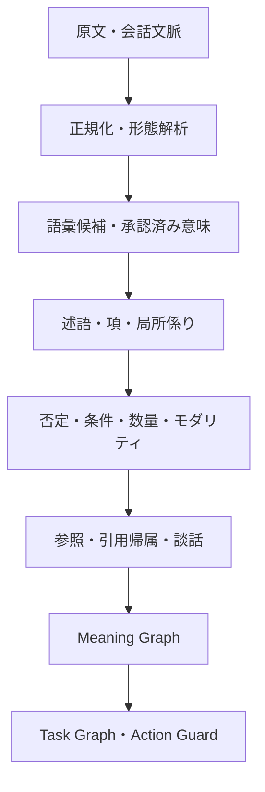

# Japanese Reading Contract / 日本語読解契約

## 日本語

### 目的

Deterministic Japanese Parser MCPの第一目的は、日本語の文字列を「正しく読解された構造」へ変換することです。辞書検索だけでも、命令検出だけでも、安全判定だけでもありません。Task GraphとExternal Action Guardは、読解後のMeaning Graphを利用する下流機能です。

この契約でいう「正しく読解する」とは、原文の根拠を保持したまま、次の問いへ決定論的に答え、確定できないものを未解決として返すことです。

1. どの語が使われ、どの語義候補があるか。
2. 誰が、何を、誰に、どこで、どうしたか。
3. 否定、数量、程度、条件、時制、相、態、話者態度がどこへ作用するか。
4. 省略語、指示語、引用内容、情報源、話者と相手の関係を特定できるか。
5. 文と文、段落と段落が、因果、対比、根拠、例示、言換え、結論のどれで接続するか。
6. 文章全体の主張、根拠、例外、条件、依頼、結論を区別できるか。

### 能力レイヤー

| 層 | 必要な結果 | 現在のRuntime |
|---|---|---|
| 文字・形態 | 原文Span、正規形、読み、品詞、活用、表記 | 実装済み |
| 語彙意味 | 複数語義、出典、License、文脈Evidence、多義性 | 承認済みPackのみRuntimeへ接続。未承認候補は不使用 |
| 文構造 | 節、述語、格項、局所係り関係、時制、相、態 | `reading_analysis`として実装 |
| 意味範囲 | 否定、数量、条件、疑問、引用、モダリティ | `scope_operators`として実装 |
| 省略・参照 | 局所先行詞、Known Entity、会話文脈、未解決参照 | 既存Meaning Graph処理と接続 |
| 語用・社会関係 | Speech Act、敬語分類、話者・相手・話題人物 | Speech Actは実装済み。敬語・ウチソトの完全判定は未完 |
| 帰属 | 引用範囲、情報源、報告述語、伝聞 | `attribution_frames`として実装 |
| 談話・文章 | 因果、対比、言換え、例示、根拠、追加、結論 | 隣接節の明示標識を実装。長文論証は未完 |
| 活用 | Task候補、制約、順序、依存、外部操作可否 | 読解後の下流処理として実装 |

### Runtimeの順序

通常の説明文からは`intent_type=observation`かつ`executable_candidate=false`のPropositionを作ります。説明を命令へ変換しません。命令、依頼、禁止等が存在する場合だけ、既存の決定論的規則がTask候補を作ります。

### `reading_analysis`出力

| Field | 意味 |
|---|---|
| `predicate_frames` | 述語、表層述語、格項、極性、時制、相、態、モダリティ |
| `dependency_arcs` | 格助詞のEvidenceから得た項と述語の局所関係 |
| `scope_operators` | 否定、条件、数量、疑問、引用、モダリティと作用対象 |
| `attribution_frames` | 引用・伝聞の内容、情報源、報告述語 |
| `discourse_relations` | 節間の因果、対比、言換え、例示、根拠、追加、結論 |
| `unresolved` | 根拠不足、対象不明、上限超過等の未解決事項 |
| `status` | `RESOLVED` / `AMBIGUOUS` / `INSUFFICIENT` / `TIMEOUT` |

すべてのFrameとOperatorは原文Spanを保持します。同じ入力、文脈、辞書、規則Versionからは同じSemantic Hashを生成します。

### 語彙データ供給との分離

125,000件の共通Review Queueは、Runtimeの読解ロジックとは別のData Supply Laneです。120,000件と5,000件を同じReviewプロセスで処理し、JMdict由来の意味候補を上書きせず、不足する極性、強度、Context、Task候補、External Action RiskをDecision Ledgerへ追加します。

Compilerは明示承認されたScopeだけを`core`、`domains`、`user`のPackへ出力します。Runtimeはその承認済みPackだけを読み込みます。これにより、語彙追加と読解ロジックを混同せず、未承認情報を本番解釈へ混入させません。

### 性能契約

| 境界 | 条件 |
|---|---:|
| 常駐済み内部処理の最適目標 | 5 ms以下 |
| MCP常駐stdio呼び出し | p95 10 ms以下 |
| 単一呼び出しの絶対上限 | 50 ms以下 |

新しい読解層もこの総時間に含みます。読解精度を増やした結果、p95 10 msを超えた場合は公開できません。時間上限内に根拠付きで確定できない項目は推測せず、`TIMEOUT`または未解決として返します。

### 公開Gate

- 通常文の述語・項・時制と非実行性
- 部分否定と数量範囲の分離
- `ば` / `たら` / `なら` / `と` / `ても`の条件種別
- 引用内容、情報源、伝聞の分離
- 明示的な節間談話関係
- 丁寧依頼と能力質問の非混同
- 条件付き外部Actionの保留
- Semantic Hashの決定性
- 既存Gold、独立Holdout、External Action Safetyの無回帰
- p95 10 ms、hard 50 ms

### 現在の境界

現在の`dependency_arcs`は、Sudachiの形態情報と格助詞から決定論的に得る局所的な述語・項関係です。自由語順、遠距離依存、複雑な並列を含む完全な係り受け解析ではありません。敬語・ウチソト、複数段落の照応、暗黙の前提、論証構造、具体と抽象の対応も完成していません。これらは対応済みと表示せず、根拠不足時は未解決として扱います。

---

## English

### Purpose

The primary purpose of Deterministic Japanese Parser MCP is to convert Japanese into a correctly read, evidence-linked structure. It is not merely a dictionary lookup, instruction detector, or safety filter. Task Graph construction and the External Action Guard are downstream consumers of the Meaning Graph.

The runtime must preserve lexical candidates, predicate-argument structure, semantic scope, reference, attribution, and discourse evidence. It must leave unsupported conclusions unresolved rather than inventing them.

### Reading layers

1. original spans, normalization, morphology, reading, POS, and inflection;
2. approved lexical senses with provenance and ambiguity;
3. clauses, predicates, case-marked arguments, tense, aspect, and voice;
4. negation, quantity, conditions, questions, quotation, and modality scope;
5. omission and reference resolution with explicit evidence;
6. speech acts, attribution, and available social context;
7. explicit discourse relations between adjacent clauses;
8. downstream task construction and external-action decisions.

Ordinary descriptions produce non-executable observation propositions. Only explicit deterministic instruction rules may produce task candidates. Runtime lexical enrichment consumes approved compiled semantic packs only; the 125,000-record Review Queue remains a separate data-supply workflow.

### Performance and release gates

The complete resident MCP call, including reading analysis, must remain at or below p95 10 ms, with an absolute 50 ms limit. Release is blocked by Gold, holdout, safety, determinism, or performance regression. Current dependency arcs are bounded morphology-and-case-particle relations, not a claim of complete dependency parsing for unrestricted Japanese. Honorific social reasoning, multi-paragraph coreference, implicit premises, argument mining, and concrete/abstract alignment remain incomplete and are not represented as finished capabilities.
