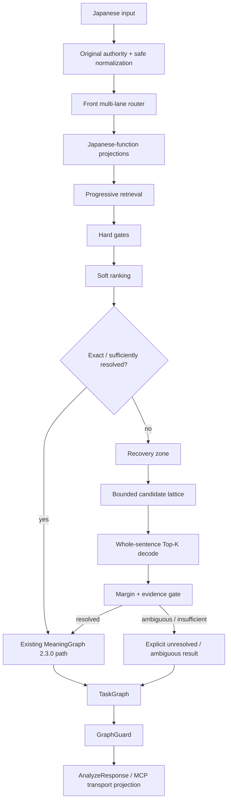

# Deterministic Japanese Parser MCP — Parser Architecture

> Status: **target architecture contract**. This document defines the architecture to be implemented and validated. It does not by itself prove that every layer is already present in runtime.
>
> Baseline used when this contract was fixed: `0aad6c6bf9ada68f1a1077228a9bc7edea9f77f5` (`0.4.0`).

## 1. Purpose

Deterministic Japanese Parser MCP (DJPMCP) exists to convert Japanese text into reproducible, inspectable structures **without runtime LLM inference** and without silently inventing missing meaning.

The parser is not an answer-generation AI. Its job is to prepare reliable material for humans, AI systems, and downstream deterministic execution layers.

The architecture therefore prioritizes:

- preservation of the original input;
- deterministic processing;
- explicit ambiguity and unresolved states;
- source/provenance/license boundaries;
- stable semantic identity;
- fail-closed external-action safety;
- bounded latency and bounded recovery work;
- compatibility with the existing `MeaningGraph` / `TaskGraph` / MCP contracts;
- independently testable build, runtime, and release gates.

## 2. Non-negotiable invariants

The following are architecture invariants, not optional optimizations.

1. **The original text is authority.** Normalization or recovery must never overwrite the caller's original input.
2. **No unsupported completion.** Missing subjects, targets, senses, causal relations, rights, or provenance are not invented.
3. **Ambiguity is data.** When evidence is insufficient, keep `AMBIGUOUS`, `UNRESOLVED`, `INSUFFICIENT`, or an equivalent explicit state.
4. **Runtime is non-AI.** Runtime analysis must not depend on an LLM or an external dictionary API.
5. **Source semantics remain distinct from inferred meaning.** Auxiliary evidence must not become semantic authority merely because it can be joined to a lexical record.
6. **Purpose routing is not meaning authority.** Purpose/source roles may guide retrieval or permissions but do not replace Japanese-language function routing or sense resolution.
7. **External actions fail closed.** If normalization/recovery changes or creates actionable meaning, execution must not be automatically allowed without the required evidence and safety gates.
8. **Rights and provenance are field-level concerns.** A record being usable for one field or one distribution lane does not automatically authorize every derived field.
9. **Semantic identity is compatibility-sensitive.** Changes that alter `MeaningGraph` hashing require an explicit compatibility/versioning gate.
10. **Physical storage layout is not architecture authority.** Logical responsibilities are fixed; database/file count is chosen by measured runtime/build characteristics.

## 3. Current reusable core

The target architecture extends rather than replaces the existing core.

The following existing contracts remain authoritative unless a separately reviewed migration changes them:

- `AnalyzeRequest` / `AnalyzeResponse` typed contracts;
- `MeaningGraph` graph version `2.3.0`;
- `TaskGraph`;
- `GraphGuard` and external-action fail-closed behavior;
- semantic quality contract and independent holdout;
- Direct Final manifest/hash gates;
- original-to-normalized source span mapping;
- deterministic reading analysis;
- existing semantic/open-lexicon runtime layers;
- MCP stdio / Streamable HTTP and parser REST/Python interfaces.

The architecture does **not** require rewriting these components from zero.

## 4. Canonical end-to-end architecture

The fixed target flow is:



Canonical processed data remains the build-time authority. The latest fixed design assumes **9,852,513 processed canonical records** as the source set to be projected and audited. The new projection/recovery architecture must not be described as runtime-complete until its full rebuild and all-record audit have actually run.

## 5. Japanese-function projections

### 5.1 Why projections exist

A single giant undifferentiated semantic store forces unrelated retrieval work into every request. The target architecture instead compiles the same canonical authority into logical projections optimized for Japanese-language responsibilities.

The projections are **derived indexes/views**, not new competing authorities.

### 5.2 Primary language-function lanes

The primary logical lanes are:

| Lane | Main responsibility |
|---|---|
| `Orthography/Reading` | writing forms, readings, normalization-safe variants, script/character evidence |
| `Noun-Entity` | nouns, names, entity candidates, aliases, mention identity |
| `Predicate-Inflection` | predicates, lemma/inflection, voice/aspect/tense-related evidence |
| `Function Words` | particles, auxiliaries and other grammatical function expressions |
| `Connective-Modifier` | conjunctions, modifiers, discourse/connective markers |
| `Onomatopoeia` | mimetic/onomatopoeic forms and interpretation evidence |
| `Multiword` | idioms, compounds, fixed/multi-token expressions |
| `Syntax-Case-Clause` | case, dependency, clause and predicate-argument evidence |
| `Sense-Semantic Relation` | sense candidates and typed semantic/lexical relations |
| `Usage-Context-Pragmatics` | register, social/pragmatic usage, context conditions |
| `Document Structure` | paragraph/document structure, argumentation and summary-related evidence |
| `Evidence-Provenance-Rights` | source lineage, rights, license, evidence and field-level permission |

### 5.3 Secondary facets

The following may be indexed and used for narrowing/ranking but are **secondary facets**, not primary lanes:

- domain;
- translation;
- sentiment;
- temporal/era information;
- frequency;
- corpus/source-specific labels.

A domain label must not replace language-function routing.

## 6. Projection compiler

The projection compiler consumes canonical records and emits deterministic runtime artifacts.

Required properties:

- deterministic record-to-projection assignment;
- source record identity preserved;
- all emitted fields traceable to canonical input;
- no silent field synthesis;
- rights/provenance carried with the field or evidence that uses it;
- counts and conservation checks recorded in a manifest;
- deterministic build outputs where the source set and tool version are identical;
- rejected/unmapped fields retained in an auditable queue rather than dropped silently.

A full build is not considered successful merely because the compiler exits with code 0. Validation must include input counts, output counts, rejected/unresolved counts, manifest/hash checks, and all-record auditing.

## 7. Front multi-lane router

The router is a deterministic front stage that decides **which logical evidence lanes are relevant to the current input**.

The router does not decide final meaning. It produces retrieval requirements and trace evidence.

A router trace must make at least the following inspectable:

- detected input features;
- selected lanes;
- skipped lanes and why they were unnecessary;
- secondary facets requested;
- whether recovery is potentially needed;
- routing version / projection version;
- limits applied to retrieval.

The router must be deterministic for identical input/context/configuration.

## 8. Purpose routing boundary

Purpose/source routing and Japanese-function routing are different layers.

Purpose routing may provide:

- retrieval hints;
- source-role masks;
- consumer allow/deny information;
- permission boundaries;
- provenance/ranking/evidence metadata.

It must **not**:

- become the sole meaning classifier;
- create lexical meaning from auxiliary evidence;
- replace the Japanese-function lanes;
- bypass field-level rights/provenance;
- turn an unknown source role into permission.

Unknown purpose/source roles fail closed where permission or consumption eligibility is material.

## 9. Progressive retrieval

The runtime should retrieve the smallest evidence set that can resolve the input, while preserving the full semantic contract.

Conceptually:

1. run the front router;
2. load router/grammar essentials;
3. retrieve only the selected lexical/semantic/context evidence;
4. apply hard eligibility gates;
5. rank eligible candidates;
6. stop when evidence/margin is sufficient;
7. enter recovery only for unresolved/OOV/abnormal segmentation or similar bounded cases;
8. load deeper context/evidence only when still required.

"Progressive" means avoiding unnecessary work, **not deleting capabilities**.

## 10. Hard gates and soft ranking

Hard gates answer whether a candidate is permitted to participate. Soft ranking orders candidates that remain eligible.

Examples of hard-gate dimensions:

- source/field rights;
- incompatible reading/part-of-speech constraints;
- forbidden consumer role;
- protected-element constraints;
- impossible span/segmentation relationship;
- invalid or missing provenance where provenance is mandatory;
- external-action safety constraints.

Examples of ranking evidence:

- exact surface/reading match;
- morphology compatibility;
- syntax/case/clause compatibility;
- sense/context fit;
- domain facet match;
- source quality/evidence strength;
- noisy-channel recovery cost.

A high ranking score cannot override a hard prohibition.

## 11. Recovery zone for noisy and mistyped input

### 11.1 No giant typo database

The design explicitly does **not** create a separate giant database containing every possible typo.

Recovery is candidate-based and bounded.

### 11.2 Recovery sequence

1. preserve original text;
2. perform only safe normalization;
3. attempt exact/normal deterministic analysis;
4. enter recovery only for unresolved/OOV/abnormal segmentation or a comparable detected need;
5. generate a bounded candidate set from surface, reading, alias, morphology, and split/merge evidence;
6. assign deterministic error/recovery costs;
7. build a bounded candidate lattice;
8. decode whole-sentence Top-K candidates;
9. rerank with grammar, syntax, sense, context, domain facets, provenance and evidence;
10. apply margin/evidence thresholds;
11. return a recovered interpretation only when the gate is satisfied;
12. otherwise preserve ambiguity/unresolved state.

### 11.3 Recovery safety rules

- Unknown or newly coined expressions are not automatically treated as typos.
- The original text remains available in output/evidence.
- Recovery evidence and the chosen interpretation must be inspectable.
- A correction may not silently change a protected element.
- If recovery creates or changes action semantics, external action must fail closed until the required safety evidence is satisfied.

## 12. Candidate lattice and whole-sentence decoding

Recovery and ambiguous segmentation require sentence-level competition between candidates rather than independent token-by-token correction.

The lattice is bounded by explicit limits such as:

- candidates per span;
- alternative split/merge paths;
- maximum total lattice nodes/edges;
- Top-K path count;
- maximum recovery time/work budget.

Whole-sentence scoring may combine:

- recovery/edit cost;
- lexical evidence;
- morphology;
- grammar;
- dependency/case evidence;
- semantic/sense compatibility;
- discourse/context evidence;
- domain facets;
- source/evidence confidence.

The winner is accepted only when the top candidate has sufficient absolute evidence **and** sufficient margin over competing candidates. Otherwise the result remains ambiguous.

## 13. Field-level rights, provenance and evidence

Eligibility belongs to fields/evidence, not only to a whole source record.

The runtime/build contracts must be able to answer:

- which source produced a field or evidence item;
- which source record/artifact it came from;
- applicable license/rights lane;
- whether public/runtime distribution is permitted;
- which consumer may use it;
- whether the field is semantic authority, ranking evidence, provenance only, or another declared role.

Auxiliary evidence may strengthen ranking or provenance without becoming lexical/sense authority.

Unknown or incomplete rights information must never be converted into implicit permission.

## 14. MeaningGraph and semantic-hash compatibility

The existing `MeaningGraph` has graph version `2.3.0` and a `semantic_hash` generated from graph content excluding the hash field itself.

This creates a strict migration rule:

> Adding default fields directly to `MeaningGraph` can change hashes for existing inputs even when semantic behavior is otherwise unchanged.

Therefore Router Trace, Recovery Evidence, field-level rights, and similar extensions must not be attached to the graph until a compatibility gate proves one of the following:

1. the extension does not change the hashed semantic payload; or
2. a deliberate graph/hash version migration is defined, tested and released.

The compatibility gate must compare representative and regression corpus outputs before/after the change and detect unexpected hash drift.

## 15. TaskGraph and GraphGuard

`TaskGraph` remains downstream of semantic interpretation. Recovery must not bypass it.

`GraphGuard` remains the final deterministic safety boundary for `execution_mode="external_action"`.

At minimum, execution is blocked when material uncertainty affects an action, including:

- unresolved targets/references;
- contradictory instructions;
- protected-element conflict;
- material semantic ambiguity;
- unsupported action-relevant interpretation;
- deadline/processing failure;
- recovery-created or recovery-changed action semantics without the required evidence.

DJPMCP returns a decision. It does not itself perform the external action.

## 16. MCP progressive output profiles

The MCP transport will support three output profiles without polluting the core `AnalyzeRequest` semantic contract.

Target contract:

```text
McpAnalyzeRequest = AnalyzeRequest + transport-only output_profile
output_profile = compact | standard | full
Default = full
```

`output_profile` must be stripped before constructing the core `AnalyzeRequest`, so profile choice cannot change parser semantics, cache identity, or `semantic_hash`.

### `full`

- preserves the existing full `AnalyzeResponse` structured shape;
- is the default for backward compatibility.

### `standard`

Keeps the information normally required for semantic consumption, including status, safety, sentence semantics, tasks and reading results, while omitting heavy transport detail such as large token/lexical/paragraph structures where omission is schema-compatible.

### `compact`

Keeps the minimum transport-safe semantic identity and decision material, including status/safety, ambiguity/unresolved signals, propositions and `semantic_hash`, while omitting heavy detail.

The text summary remains backward compatible and is derived from the full semantic response before transport projection.

The runtime cache stores semantic/full results and must not create separate semantic identities for output profiles.

## 17. Logical runtime bundles

The initial logical runtime bundle plan is:

- `router_core`;
- `grammar_core`;
- `lexical_semantic`;
- `context_evidence`;
- `recovery_index`.

These are responsibility boundaries. They do not require five physical databases. Physical layout is selected using build size, memory, cold/warm latency, I/O behavior, deployment atomicity and rollback measurements.

## 18. Performance contract

The final architecture must be measured after the full projection/recovery implementation and the full canonical rebuild.

The fixed final acceptance target for the new architecture is:

- production-representative **p95 < 500 ms** for the defined final benchmark workload;
- bounded recovery work;
- no unbounded scan of all 9.85M canonical records per request;
- progressive retrieval proven by trace/benchmark evidence;
- no correctness reduction merely to hit latency.

Existing narrower 10 ms / 50 ms contracts in the repository remain valid for the scopes they currently define until an explicit contract migration replaces them. They must not be confused with the final end-to-end architecture acceptance benchmark.

## 19. Build and validation gates

The final architecture is not complete until all of the following are closed with evidence.

### Source and contract gates

- output-profile transport contract;
- semantic-hash compatibility gate;
- router trace contract;
- recovery interpretation evidence contract;
- field-level rights/provenance contract;
- projection schema/manifest contract;
- deterministic bundle/version contract.

### Data gates

- full canonical rebuild;
- **9,852,513-record** accounting for the fixed canonical set or an explicitly versioned replacement count;
- all-record audit;
- unresolved/rejected accounting;
- rights/provenance audit;
- deterministic rebuild/hash checks.

### Robustness gates

- clean Japanese regression;
- noisy input;
- typographical errors;
- broken/colloquial text;
- segmentation ambiguity;
- unknown/new expression handling;
- false-correction rate;
- ambiguity-retention rate;
- external-action recovery safety.

### Regression and runtime gates

- targeted unit/contract tests;
- existing MCP boundary tests;
- full regression suite;
- performance benchmark including p95;
- actual runtime deployment when authorized;
- runtime/provider readback where applicable.

Process start, HTTP 200, empty output, test-runner exit, or CI green alone is not sufficient to prove semantic completion.

## 20. Implementation sequence

The fixed implementation order is:

```text
M0-1: MCP compact / standard / full transport profile
  ↓
MCP targeted tests
  ↓
semantic_hash compatibility gate
  ↓
Router Trace
  ↓
Recovery Interpretation Evidence
  ↓
Field-level Rights / Provenance
  ↓
Japanese-function Projection Compiler
  ↓
Front multi-lane Router
  ↓
Recovery Index / Candidate Lattice / whole-sentence Top-K
  ↓
Progressive Context Retrieval
  ↓
9.85M full Build / Audit
  ↓
Clean + Noisy + Typo + Broken-text Regression
  ↓
False-correction / Ambiguity-retention metrics
  ↓
p95 < 500 ms final benchmark
  ↓
Full Regression
  ↓
Authorized Runtime deployment + readback
```

A later step must not be marked PASS because an earlier isolated test passed.

## 21. Implementation status at architecture freeze

At the time this document was introduced:

| Area | Status |
|---|---|
| Existing MeaningGraph / TaskGraph / GraphGuard | Existing; reuse |
| Existing MCP typed base | Existing; reuse |
| Existing semantic quality / holdout | Existing; reuse |
| Existing Direct Final manifest/hash gates | Existing; reuse |
| Purpose routing | Partial integration work exists; final consumer effect incomplete |
| MCP output profiles | Design fixed; VPS implementation not yet applied at the verified baseline |
| Semantic-hash compatibility gate | Not implemented |
| Router trace | Not implemented |
| Recovery evidence/index/lattice/Top-K | Not implemented |
| Field-level rights/provenance extension | Not implemented |
| Japanese-function projection compiler | Not implemented |
| Front multi-lane router | Not implemented |
| Progressive context retrieval | Not implemented |
| 9.85M rebuild/all-record audit under this architecture | Not run |
| Final robustness suite | Not run |
| Final p95 < 500 ms benchmark | Not run |
| Final full regression | Not run |
| Runtime deployment of this target architecture | Not deployed |

This table is intentionally conservative. Documentation of the target architecture is not implementation evidence.

## 22. Related public contracts

- [`../README.md`](../README.md) — project overview and current/target status
- [`README.md`](README.md) — documentation index
- [`UNIFIED_SEMANTIC_DATA_PIPELINE.md`](UNIFIED_SEMANTIC_DATA_PIPELINE.md) — canonical data intake/build pipeline
- [`LANGUAGE_DATA_RUNTIME.md`](LANGUAGE_DATA_RUNTIME.md) — reviewed language-data runtime contract
- [`JAPANESE_READING_CONTRACT.md`](JAPANESE_READING_CONTRACT.md) — deterministic reading contract
- [`SEMANTIC_QUALITY_CONTRACT.md`](SEMANTIC_QUALITY_CONTRACT.md) — semantic quality and holdout gates
- [`DIRECT_FINAL_RUNTIME_DEPLOYMENT.md`](DIRECT_FINAL_RUNTIME_DEPLOYMENT.md) — Direct Final runtime bundle/deployment boundary
- [`PERFORMANCE_AND_RELEASE_CONTRACT.md`](PERFORMANCE_AND_RELEASE_CONTRACT.md) — existing scoped performance/release contracts
- [`ASTERA_HOSTED_API_ARCHITECTURE.md`](ASTERA_HOSTED_API_ARCHITECTURE.md) — hosted commercial-service boundary

## 23. Definition of done

The target architecture is complete only when the required source changes, data rebuild/audit, robustness gates, performance gates, full regression, and authorized runtime readback all provide matching evidence.

Until then, individual sections may be `PASS`, `PARTIAL`, `BLOCKED`, `UNKNOWN`, `NOT_RUN`, or `NOT_IMPLEMENTED`, but the whole architecture must not be presented as complete.