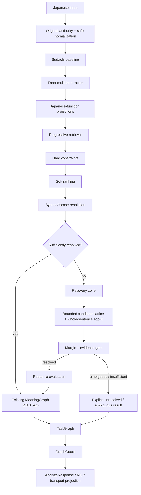

# Deterministic Japanese Parser MCP — Parser Architecture

> Status: **target architecture contract**. This document defines the architecture to be implemented and validated. It does not by itself prove that every layer is already present in runtime.
>
> Baseline used when this contract was fixed: `0aad6c6bf9ada68f1a1077228a9bc7edea9f77f5` (`0.4.0`).

## 1. Purpose

Deterministic Japanese Parser MCP (DJPMCP) converts Japanese text into reproducible, inspectable structures **without runtime LLM inference** and without silently inventing missing meaning.

The parser is not an answer-generation AI. Its job is to prepare reliable material for humans, AI systems, Astera, Agents, and deterministic downstream execution layers.

The highest-level product requirement is:

> **Return the necessary complete Japanese reading result within 0.5 seconds without deleting reading accuracy, MeaningGraph information, ambiguity retention, reading evidence, or fail-closed safety to achieve speed.**

The architecture therefore prioritizes:

- preservation of the original input;
- deterministic processing;
- explicit ambiguity and unresolved states;
- source/provenance/license boundaries;
- stable semantic identity;
- fail-closed external-action safety;
- bounded latency and bounded recovery work;
- compatibility with the existing `MeaningGraph` / `TaskGraph` / MCP contracts;
- independently testable build, runtime, and release gates.

## 2. Non-negotiable invariants

1. **The original text is authority.** Normalization or recovery must never overwrite the caller's original input.
2. **No unsupported completion.** Missing subjects, targets, senses, causal relations, rights, or provenance are not invented.
3. **Ambiguity is data.** When evidence is insufficient, keep `AMBIGUOUS`, `UNRESOLVED`, `INSUFFICIENT`, or the equivalent explicit state.
4. **Runtime is non-AI.** Runtime analysis must not depend on an LLM or an external dictionary API.
5. **Source semantics remain distinct from inferred meaning.** Auxiliary evidence must not become semantic authority merely because it can be joined to a lexical record.
6. **Purpose routing is not meaning authority.** Purpose/source roles may guide retrieval or permissions but do not replace Japanese-language function routing or sense resolution.
7. **External actions fail closed.** If normalization/recovery changes or creates actionable meaning, execution must not be automatically allowed without the required evidence and safety gates.
8. **Rights and provenance are field-level concerns.** A record being usable for one field or one distribution lane does not automatically authorize every derived field.
9. **Semantic identity is compatibility-sensitive.** Changes that alter `MeaningGraph` hashing require an explicit compatibility/versioning gate.
10. **Physical storage layout is not architecture authority.** Logical responsibilities are fixed; database/file count is selected by measured runtime/build characteristics.

## 3. Existing core to preserve

The target architecture extends rather than replaces the existing core.

The following existing contracts remain authoritative unless an explicitly reviewed migration changes them:

- `AnalyzeRequest` / `AnalyzeResponse` typed contracts;
- `MeaningGraph` graph version `2.3.0`;
- `TaskGraph`;
- `GraphGuard` and external-action fail-closed behavior;
- semantic quality contract and independent holdout;
- Direct Final manifest/hash gates;
- original-to-normalized source span mapping;
- deterministic reading analysis;
- existing semantic/open-lexicon runtime layers;
- MCP stdio / Streamable HTTP and parser REST/Python interfaces.

The architecture does **not** require rewriting these components from zero.

## 4. Canonical end-to-end architecture



Canonical processed data remains the build-time authority. The latest fixed design references **9,852,513 processed canonical records** as the source set to be projected and audited. The new projection/recovery architecture must not be described as runtime-complete until its full rebuild and all-record audit have actually run.

## 5. Japanese-function projections

A single giant undifferentiated semantic store must not become a per-request full-scan dependency. The target architecture compiles the same canonical authority into logical projections optimized for Japanese-language responsibilities.

The projections are **derived indexes/views**, not new competing authorities.

### Primary language-function lanes

| Lane | Main responsibility |
|---|---|
| `Orthography/Reading` | writing forms, readings, normalization-safe variants, script/character evidence |
| `Noun-Entity` | nouns, names, entity candidates, aliases, mention identity |
| `Predicate-Inflection` | predicates, lemma/inflection, voice/aspect/tense-related evidence |
| `Function Words` | particles, auxiliaries and other grammatical function expressions |
| `Connective-Modifier` | conjunctions, modifiers, discourse/connective markers |
| `Onomatopoeia` | mimetic/onomatopoeic forms and interpretation evidence |
| `Multiword` | idioms, compounds, fixed/multi-token expressions |
| `Syntax-Case-Clause` | case, dependency, clause and predicate-argument evidence |
| `Sense-Semantic Relation` | sense candidates and typed semantic/lexical relations |
| `Usage-Context-Pragmatics` | register, social/pragmatic usage, context conditions |
| `Document Structure` | paragraph/document structure, argumentation and summary evidence |
| `Evidence-Provenance-Rights` | source lineage, rights, license, evidence and field-level permission |

### Secondary facets

The following may be indexed and used for narrowing/ranking but are **secondary facets**, not primary lanes:

- domain;
- translation;
- sentiment;
- temporal/era information;
- frequency;
- corpus/source-specific labels.

A domain label must not replace language-function routing.

## 6. Projection compiler

The projection compiler consumes canonical records and emits deterministic runtime artifacts.

Required properties:

- deterministic record-to-projection assignment;
- source record identity preserved;
- all emitted fields traceable to canonical input;
- no silent field synthesis;
- rights/provenance carried with the field or evidence that uses it;
- counts and conservation checks recorded in a manifest;
- deterministic build outputs for identical source set/tool version;
- rejected/unmapped fields retained in an auditable queue rather than dropped silently;
- every bundle bound to compatible `canonical_manifest_sha / schema_version / projection_policy_version / scoring_policy_version`;
- incompatible bundle combinations rejected at startup;
- bundle-set switch atomic and rollback-capable.

A full build is not successful merely because the compiler exits with code 0. Validation must include input counts, output counts, rejected/unresolved counts, manifest/hash checks, rights/provenance checks, and all-record auditing.

## 7. Front multi-lane router

The router deterministically decides **which logical evidence lanes are relevant to the current input**. It does not decide final meaning.

The router must keep primary/secondary/fallback candidates instead of forcing a single lane too early.

A router trace must make at least the following inspectable:

- detected input features;
- `router_decision`;
- `candidate_lanes`;
- `selected_lanes`;
- skipped lanes and why they were unnecessary;
- secondary facets requested;
- `fallback_reason`;
- whether recovery is potentially needed;
- routing version / projection version;
- retrieval limits.

Fallback or recovery is required when conditions such as `exact=0`, OOV, suspicious segmentation, grammar conflict, or syntax conflict make the narrow route insufficient. After recovery, the router is evaluated again.

The router must be deterministic for identical input/context/runtime data/configuration.

## 8. Purpose routing boundary

Purpose/source routing and Japanese-function routing are different layers.

Purpose routing may provide:

- retrieval hints;
- source-role masks;
- consumer allow/deny information;
- permission boundaries;
- provenance/ranking/evidence metadata.

It must **not**:

- become the sole meaning classifier;
- create lexical meaning from auxiliary evidence;
- replace Japanese-function lanes;
- bypass field-level rights/provenance;
- turn an unknown source role into permission.

Unknown purpose/source roles fail closed where permission or consumption eligibility is material.

## 9. Progressive retrieval

The runtime retrieves the smallest evidence set that can resolve the input while preserving the full semantic contract.

Conceptually:

1. preserve original authority and perform only safe normalization;
2. run Sudachi baseline;
3. run the front router;
4. load router/grammar essentials;
5. retrieve only selected lexical/semantic/context evidence;
6. apply hard eligibility constraints;
7. rank eligible candidates;
8. resolve syntax/sense;
9. load deeper context/domain evidence only when required;
10. stop when evidence/margin is sufficient;
11. enter recovery only for unresolved/OOV/abnormal segmentation/conflict or comparable bounded cases.

"Progressive" means avoiding unnecessary work, **not deleting capabilities**.

## 10. Hard constraints and soft ranking

Hard constraints answer whether a candidate is permitted to participate. Soft ranking orders candidates that remain eligible.

Hard-gate examples:

- source/field rights;
- incompatible reading/part-of-speech constraints;
- forbidden consumer role;
- protected-element constraints;
- impossible span/segmentation relationship;
- invalid or missing provenance where provenance is mandatory;
- external-action safety constraints.

Ranking evidence examples:

- exact surface/reading match;
- morphology compatibility;
- segmentation/connection compatibility;
- syntax/case/clause compatibility;
- sense/context fit;
- domain facet match;
- source quality/evidence strength;
- noisy-channel recovery cost.

A high ranking score cannot override a hard prohibition.

## 11. Recovery zone for noisy and mistyped input

### 11.1 No giant typo database

The design explicitly does **not** create a separate giant database containing every possible typo and does not fuzzy-match the whole sentence by default.

Recovery is candidate-based, local, bounded, and entered only when normal analysis fails to resolve a span sufficiently.

### 11.2 Recovery sequence

1. preserve original text;
2. perform only safe normalization;
3. attempt exact/normal deterministic analysis;
4. enter recovery only for unresolved/OOV/abnormal segmentation/conflict or a comparable detected need;
5. include adjacent boundaries where split/merge is relevant;
6. generate finite candidates for kana/katakana, dakuten/handakuten, small kana, long vowel, okurigana, contraction, insertion/deletion/substitution/transposition, split/merge and declared aliases;
7. only promote candidates that land on an actual runtime surface/lemma/reading/alias;
8. assign deterministic recovery/error costs;
9. build a bounded local candidate lattice;
10. decode whole-sentence Top-K/beam/Viterbi-style candidates;
11. rerank with reading, POS/morphology, segmentation/connection, grammar, syntax/case, sense, usage/context, domain facet, provenance and evidence;
12. apply margin/evidence thresholds;
13. return a recovered interpretation only when the gate is satisfied;
14. otherwise preserve ambiguity/unresolved state.

The bounds (`beam width / max span / max candidates / max passes / recovery margin`) are not arbitrary permanent constants. They must be calibrated by Golden/Noise/Latency benchmarks.

### 11.3 Recovery safety rules

- Unknown or newly coined expressions are not automatically treated as typos.
- The original text remains available in output/evidence.
- Recovery evidence and the chosen interpretation must be inspectable and tied to the original span.
- A correction may not silently change a protected element.
- Multiple valid meanings with insufficient margin remain ambiguous.
- If recovery creates or changes action predicate/target/intent semantics, external action must fail closed with a dedicated reason such as `RECOVERY_CHANGED_ACTION_SEMANTICS` until the required safety evidence is satisfied.

## 12. Candidate lattice and whole-sentence decoding

Recovery and ambiguous segmentation require sentence-level competition between candidates rather than independent token-by-token correction.

The lattice is bounded by explicit limits such as:

- candidates per span;
- alternative split/merge paths;
- maximum total lattice nodes/edges;
- Top-K path count;
- maximum recovery passes;
- maximum recovery work/time budget.

Whole-sentence scoring may combine:

- recovery/edit cost;
- lexical evidence;
- morphology;
- grammar;
- segmentation/connection;
- dependency/case evidence;
- semantic/sense compatibility;
- discourse/context evidence;
- domain facets;
- source/evidence confidence.

The winner is accepted only when the top candidate has sufficient absolute evidence **and** sufficient margin over competing candidates. Otherwise the result remains ambiguous.

## 13. Field-level rights, provenance and evidence

Eligibility belongs to fields/evidence, not only to a whole source record.

The contract must support values such as `senses / examples / translations / relations / metrics / aliases` being traced through:

`evidence_id → source_id/version → field semantics → license/rights lane → allowed consumer/use → forbidden use`.

The runtime/build contracts must therefore be able to answer:

- which source produced a field or evidence item;
- which source record/artifact it came from;
- applicable license/rights lane;
- whether public/runtime distribution is permitted;
- which consumer may use it;
- whether the field is semantic authority, ranking evidence, provenance only, or another declared role.

Auxiliary evidence may strengthen ranking or provenance without becoming lexical/sense authority. Sentiment/temporal and similar context-dependent facets are lexical priors, not final contextual judgments.

Unknown or incomplete rights information must never become implicit permission.

## 14. MeaningGraph and semantic-hash compatibility

The existing `MeaningGraph` has graph version `2.3.0` and a `semantic_hash` generated from graph content excluding the hash field itself.

This creates a strict migration rule:

> Adding default fields directly to `MeaningGraph` can change hashes for existing inputs even when semantic behavior is otherwise unchanged.

Recovery/Interpretation Evidence, Router Trace, and field-level evidence references are target MeaningGraph extensions, but they must not be connected until a compatibility gate proves one of the following:

1. the extension does not change the existing hashed semantic payload unexpectedly; or
2. a deliberate graph/hash version migration is defined, tested, and released.

The compatibility gate must compare representative and regression-corpus outputs before/after the change and detect unexpected hash drift.

## 15. TaskGraph and GraphGuard

`TaskGraph` remains downstream of semantic interpretation. Recovery must not bypass it.

`GraphGuard` remains the final deterministic semantic-safety boundary for `execution_mode="external_action"`.

At minimum, execution is blocked when material uncertainty affects an action, including:

- unresolved targets/references;
- contradictory instructions;
- protected-element conflict;
- material semantic ambiguity;
- unsupported action-relevant interpretation;
- deadline/processing failure;
- recovery-created or recovery-changed action semantics without the required evidence.

Parser `execution_allowed` is a semantic-safety decision, not provider/OS authorization or human approval. Actual external action requires a separate caller-side authorization/approval boundary.

DJPMCP returns a decision. It does not itself perform the external action.

## 16. MCP progressive output profiles

The MCP transport will support three output profiles without polluting the core `AnalyzeRequest` semantic contract.

Target contract:

```text
McpAnalyzeRequest = AnalyzeRequest + transport-only output_profile
output_profile = compact | standard | full
Default = compact
```

`output_profile` must be stripped before constructing the core `AnalyzeRequest`, so profile choice cannot change parser semantics, cache identity, or `semantic_hash`.

### `compact`

Default profile. Returns lightweight decision material such as status, principal Reading/Proposition information, important ambiguity/missing information, action safety, and semantic hash. It is a transport projection only; it must not reduce the internal MeaningGraph.

### `standard`

Progressively discloses more semantic structure, tasks, reading detail, and evidence-related information while still withholding the heaviest transport payload where omission is schema-compatible.

### `full`

Preserves the existing full `AnalyzeResponse` structured shape for callers that explicitly require all current transport detail.

The text summary remains backward compatible and is derived from the full semantic response before transport projection.

The runtime cache stores the semantic/full result and must not create separate semantic identities for output profiles.

Maximum profile bytes and exposed node/candidate limits are not fixed by guesswork. They are calibrated by context/latency benchmarks without using output truncation to weaken internal reading completeness.

## 17. Logical runtime bundles

The initial logical runtime bundle plan is:

- `router_core`;
- `grammar_core`;
- `lexical_semantic`;
- `context_evidence`;
- `recovery_index`.

These are responsibility boundaries. They do not require five physical databases. Physical layout is selected using build size, memory, cold/warm latency, I/O behavior, deployment atomicity and rollback measurements.

## 18. Performance contract

The top-level product requirement is **the necessary complete Japanese reading result within 0.5 seconds**.

Existing narrower internal targets such as `target_latency_ms=10` and `hard_deadline_ms=50` remain Hot-path/scoped contracts unless an explicit migration changes them. Recovery is not a reason to silently relax them.

Production acceptance must record at least:

- hardware / CPU / RAM;
- warm vs cold conditions;
- input-length class;
- concurrency;
- p50 / p95 / p99;
- MCP / HTTP boundary;
- phase-level work/latency where relevant.

No single percentile metric may be used to replace the higher-level 0.5-second product requirement. Speed is not achieved by deleting reading accuracy, MeaningGraph content, ambiguity retention, evidence, or fail-closed behavior.

## 19. Build and validation gates

The final architecture is not complete until all required gates are closed with evidence.

### Source and contract gates

- MCP output-profile transport contract;
- semantic-hash compatibility gate;
- Router Trace contract;
- Recovery Interpretation Evidence contract;
- field-level rights/provenance contract;
- projection schema/manifest contract;
- deterministic bundle/version compatibility contract.

### Data gates

- full canonical rebuild;
- **9,852,513-record** accounting for the fixed canonical set or an explicitly versioned replacement count;
- all-record audit;
- unresolved/rejected accounting;
- rights/provenance audit;
- deterministic rebuild/hash checks.

### Robustness gates

- clean Japanese regression;
- noisy input;
- typographical errors;
- broken/colloquial text;
- segmentation ambiguity;
- proper noun;
- function word;
- connective;
- onomatopoeia;
- multiword/fixed expression;
- long text;
- unknown/new expression handling;
- Router lane recall / false exclusion / OOV fallback;
- Recovery success;
- false-correction rate;
- ambiguity-retention rate;
- recovered-action safety;
- field-rights integrity;
- MCP output size;
- recovery latency.

Clean Gold cases are paired with deterministic synthetic-noise cases. The goal is that Clean and Noisy inputs converge to the same meaning when evidence is sufficient, and remain correctly ambiguous when it is not. Recovery success alone is never enough; false correction is a mandatory metric.

### Regression and runtime gates

- targeted unit/contract tests;
- existing MCP boundary tests;
- existing Semantic Quality and Independent Holdout;
- full regression suite;
- production-representative performance evidence;
- actual runtime deployment only when authorized;
- runtime/provider readback where applicable.

Process start, HTTP 200, empty output, build success, test-runner exit, or CI green alone is not sufficient to prove semantic completion.

## 20. Implementation sequence

The fixed near-term implementation order from the current checkpoint is:

```text
M0-1: MCP compact / standard / full transport profile
  ↓
MCP targeted tests
  ↓
semantic_hash compatibility gate
  ↓
Router Trace / Recovery Interpretation Evidence / Field-level Rights contract
  ↓
Japanese-function Projection Compiler
  ↓
Front multi-lane Router
  ↓
existing MeaningGraph connection
  ↓
Recovery Index / Candidate Lattice / whole-sentence Top-K
  ↓
Progressive Context / Evidence Retrieval
  ↓
9.85M full Build / Audit
  ↓
Clean + Noisy + Typo + Broken-text Regression
  ↓
False-correction / Ambiguity-retention metrics
  ↓
0.5-second complete-reading Performance Acceptance
  ↓
Full Regression
  ↓
Authorized Runtime deployment + readback
```

A later step must not be marked PASS because an earlier isolated test passed.

## 21. Implementation status at architecture freeze

| Area | Status |
|---|---|
| Existing MeaningGraph / TaskGraph / GraphGuard | Existing; reuse |
| Existing MCP typed base | Existing; reuse |
| Existing Semantic Quality / Holdout | Existing; reuse |
| Existing Direct Final manifest/hash gates | Existing; reuse |
| Purpose routing | Partial integration work exists; final consumer effect incomplete |
| MCP output profiles | Design fixed; VPS source/runtime implementation not yet verified at the baseline checkpoint |
| Semantic-hash compatibility gate | Not implemented |
| Router Trace | Not implemented |
| Recovery evidence/index/lattice/Top-K | Not implemented |
| Field-level rights/provenance extension | Not implemented |
| Japanese-function Projection Compiler | Not implemented |
| Front multi-lane Router | Not implemented |
| Progressive Context Retrieval | Not implemented |
| 9.85M rebuild/all-record audit under this architecture | Not run |
| Final robustness suite | Not run |
| Final 0.5-second complete-reading acceptance | Not run |
| Final full regression | Not run |
| Runtime deployment of this target architecture | Not deployed |

This table is intentionally conservative. Documentation of the target architecture is not implementation evidence.

## 22. Related public contracts

- [`../README.md`](../README.md) — project overview and current/target status
- [`README.md`](README.md) — documentation index
- [`UNIFIED_SEMANTIC_DATA_PIPELINE.md`](UNIFIED_SEMANTIC_DATA_PIPELINE.md) — canonical data intake/build pipeline
- [`LANGUAGE_DATA_RUNTIME.md`](LANGUAGE_DATA_RUNTIME.md) — reviewed language-data runtime contract
- [`JAPANESE_READING_CONTRACT.md`](JAPANESE_READING_CONTRACT.md) — deterministic reading contract
- [`SEMANTIC_QUALITY_CONTRACT.md`](SEMANTIC_QUALITY_CONTRACT.md) — semantic quality and holdout gates
- [`DIRECT_FINAL_RUNTIME_DEPLOYMENT.md`](DIRECT_FINAL_RUNTIME_DEPLOYMENT.md) — Direct Final runtime bundle/deployment boundary
- [`PERFORMANCE_AND_RELEASE_CONTRACT.md`](PERFORMANCE_AND_RELEASE_CONTRACT.md) — existing scoped performance/release contracts
- [`ASTERA_HOSTED_API_ARCHITECTURE.md`](ASTERA_HOSTED_API_ARCHITECTURE.md) — hosted commercial-service boundary

## 23. Definition of done

The target architecture is complete only when the required source changes, data rebuild/audit, robustness gates, performance gates, full regression, and authorized runtime readback all provide matching evidence.

Until then, individual scopes may be `PASS`, `FAIL`, `PARTIAL`, `BLOCKED`, `UNKNOWN`, `NOT_EXECUTED`, or `NOT_VERIFIED`, but the whole architecture must not be presented as complete.