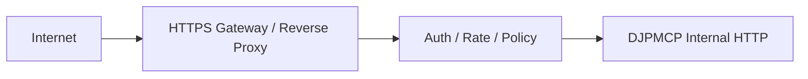

# Production HTTP Deployment / Production HTTP配置ガイド

Version 1.0 — 2026-09-26

## 目的

この文書は、`djpmcp-http` をProduction環境へ配置するときに、Public Repositoryとして公開してよい**安全な構成原則・設定項目・確認方法**をまとめたものです。

Project Owner運営のAstera Hosted APIでは、DJPMCPをInternetへ直接Customer-facing公開するのではなく、Astera Gatewayの内側へ置く構成を推奨します。商用Architectureは[`ASTERA_HOSTED_API_ARCHITECTURE.md`](ASTERA_HOSTED_API_ARCHITECTURE.md)を参照してください。

---

## 1. 現行HTTP Runtime

Package entrypoint：

```text
djpmcp-http
```

既定値：

```text
DJPMCP_HTTP_HOST=127.0.0.1
DJPMCP_HTTP_PORT=8765
DJPMCP_HTTP_WORKERS=1
```

Public Docker用の`Dockerfile.http`ではContainer内Listenのため`0.0.0.0:8765`を使用します。

公開されるRoute：

| Route | Method | 用途 | Auth |
|---|---|---|---|
| `/healthz` | GET | Process/Service Health | Public |
| `/readyz` | GET | Prewarm完了後のReadiness | Public |
| `/v1/analyze` | POST | Parser REST interface | Protected |
| `/mcp` | MCP HTTP | Streamable HTTP MCP | Protected |

---

## 2. 最小Production原則

Productionでは最低限、次を満たします。

1. `DJPMCP_HTTP_ALLOW_UNAUTHENTICATED=1`をPublic Networkで使わない。
2. `DJPMCP_HTTP_API_KEY`をSource Code、Dockerfile、Git、READMEへ直書きしない。
3. TLS終端をReverse Proxy / Gateway側で行う。
4. Customer-facing APIの場合はDJPMCP独自KeyをCustomerへ直接配らず、Platform GatewayでCustomer Authを処理する。
5. `/readyz`をRouting判定に使い、Prewarm前にTrafficを流さない。
6. Allowed Host / OriginをDeployment Environmentに合わせて絞る。
7. Parser Runtimeを可能ならPrivate Network / Loopback / Internal Container Networkへ置く。
8. Production SecretをEnvironment/Secret Storeから注入する。
9. Raw credentialをLogへ出さない。
10. Runtime versionとDeployment versionを追跡できる状態にする。

---

## 3. HTTP関連Environment Variables

現行`http_server.py`が利用する主な設定です。

| Variable | Default | 説明 |
|---|---:|---|
| `DJPMCP_HTTP_HOST` | `127.0.0.1` | Listen host |
| `DJPMCP_HTTP_PORT` | `8765` | Listen port |
| `DJPMCP_HTTP_WORKERS` | `1` | Uvicorn worker数 |
| `DJPMCP_HTTP_API_KEY` | empty | HTTP/MCP保護Key |
| `DJPMCP_HTTP_ALLOW_UNAUTHENTICATED` | false | 明示的な認証無効化 |
| `DJPMCP_HTTP_MAX_BODY_BYTES` | `1048576` | 最大request body |
| `DJPMCP_HTTP_ALLOWED_ORIGINS` | empty | CORS allowed origins |
| `DJPMCP_HTTP_ALLOWED_HOSTS` | loopback系 | DNS rebinding protection用host |

Parser Engine側設定についてはREADMEのConfiguration sectionを参照してください。

---

## 4. Authentication

Runtime HTTP Serverは次のいずれかを受け付けます。

```http
Authorization: Bearer <key>
```

または

```http
X-API-Key: <key>
```

比較にはconstant-time comparisonが使われます。

### 注意

この単一Runtime API Keyは、**Multi-tenant paid customer credential systemそのものではありません**。

Astera Hosted APIでは：

```text
Customer credential
  -> Astera Gateway
  -> internal service credential
  -> DJPMCP Runtime
```

という分離を推奨します。

---

## 5. Health / Readiness

### `/healthz`

Service processが応答可能かを確認します。

### `/readyz`

Startup lifespan内で`prewarm()`が完了し、RuntimeがTrafficを受けられる状態になってから`200`を返します。Readyでない場合は`503`です。

Load Balancer / Reverse Proxy / Orchestratorでは、Traffic可否の判定に`/readyz`を優先します。

---

## 6. Prewarm

DJPMCPはServing前にprewarmを行います。

主に次をRuntime deadline外で準備します。

- Sudachi lazy initialization
- tokenizer warmup
- rule candidate index
- metaphor literal matcher
- Pydantic input/output schema
- representative Meaning Graph / Task Graph path

これにより、最初のCustomer RequestへCold initialization costを混入させない設計です。

---

## 7. Request Protection

現行HTTP Serverには次のProtectionがあります。

- API key middleware
- `application/json` Content-Type validation
- Content-Length validation
- Actual body size validation
- configurable maximum body bytes
- DNS rebinding protection
- allowed host restriction
- allowed origin restriction
- CORSを明示設定時のみ有効化
- stateless Streamable HTTP MCP

ただしInternet-facing Productionでは、これに加えてGateway/WAF/Rate limit/Abuse controlを外側へ配置してください。

---

## 8. Reverse Proxy / Gateway Boundary

推奨構成：



DJPMCP Runtime自身へPublic DNSを直接向ける必要はありません。

Astera Commercial ServiceではGateway層にCustomer Authorization、Quota、Billing関連判定を置きます。

---

## 9. Docker

RepositoryにはHTTP Runtime用`Dockerfile.http`があります。

Build例：

```bash
docker build -f Dockerfile.http -t djpmcp-http .
```

Local protected run例：

```bash
docker run --rm \
  -p 127.0.0.1:8765:8765 \
  -e DJPMCP_HTTP_API_KEY="$DJPMCP_HTTP_API_KEY" \
  djpmcp-http
```

上記は例です。Production SecretをShell historyへ残す運用を推奨するものではありません。実運用ではOrchestrator/Secret Store等から注入してください。

---

## 10. CORS

`DJPMCP_HTTP_ALLOWED_ORIGINS`が空の場合、CORS middlewareは追加されません。

Browserから直接Runtimeへアクセスさせる必要がある場合だけ、必要Originを明示的に指定します。

Commercial PlatformではBrowser -> DJPMCP直接接続より、Browser -> Astera Application/API -> DJPMCP Internal Runtimeの構成を推奨します。

---

## 11. Allowed Hosts

既定はloopback向けです。

Custom hostnameやContainer/Gateway経路を使う場合は、Deploymentに必要なHostだけを`DJPMCP_HTTP_ALLOWED_HOSTS`へ設定します。

広すぎるWildcardを常用するのではなく、Environmentごとに許可Hostを固定することを推奨します。

---

## 12. Parser Engine Configuration

主要設定：

```text
DJPMCP_MAX_INPUT_LENGTH=20000
DJPMCP_MAX_CONTEXT_ITEMS=20
DJPMCP_MAX_CANDIDATES=8
DJPMCP_REGEX_TIMEOUT_MS=25
DJPMCP_TARGET_LATENCY_MS=10
DJPMCP_HARD_DEADLINE_MS=50
DJPMCP_MAX_GRAPH_NODES=512
DJPMCP_MAX_SCOPE_EDGES=1024
DJPMCP_LOG_PATH=...
DJPMCP_SYSTEM_DICT_DIR=...
DJPMCP_USER_DICT_DIR=...
DJPMCP_SEMANTIC_DATA_RUNTIME_DIR=...
```

Performance値は単なる希望値ではなく、CI側のPerformance Contractと合わせて扱います。Infrastructureを変更した場合は再計測してください。

---

## 13. Runtime Data

Productionでは、利用するDictionary / Semantic Runtime Bundleを明示的に固定します。

- bundle/versionを追跡可能にする
- manifest/digestを保持する
-未承認Review QueueをRuntimeへ直接読み込ませない
- rollout前にvalidation gateを通す
- rollback可能なartifactを維持する

完成Runtime Bundleの詳細は[`DIRECT_FINAL_RUNTIME_DEPLOYMENT.md`](DIRECT_FINAL_RUNTIME_DEPLOYMENT.md)を参照してください。

---

## 14. Observability

最低限、次をDeployment側で観測できることを推奨します。

- process/container health
- readiness
- request count
- response status
- latency
- timeout count
- error count
- parser version
- runtime data version/digest
- resource usage

Commercial APIではさらにGateway側Request IDとの相関を保持します。

---

## 15. Logの境界

Parserは`PARTIAL`や`FAILED`時にdiagnostic informationを記録できます。

Productionでは次を確認してください。

- `DJPMCP_LOG_PATH`の保存先
- retention
- file permission
- log rotation
- Customer inputの取り扱い方針
- backup対象か
- deletion policy

Commercial Customer Dataを扱う場合、単にDebugに便利だからという理由でRaw Inputを無期限保存しない設計を推奨します。

---

## 16. Deployment Gate

Productionへ反映する前に最低限：

```bash
python scripts/preflight.py
python tools/lexicon_validator.py
python tools/validator.py
pytest
python scripts/benchmark.py --check --rounds 50
python scripts/performance_contract.py --check --rounds 50 --stdio-rounds 30 --scale 20 --max-ready-ms 10
python scripts/astera_latency_contract.py --check --rounds 50 --stdio-rounds 30 --target-ms 10 --hard-ms 50
```

Runtime Bundleを使う場合は該当Deployment Contractも追加で通します。

---

## 17. Commercial Productionで追加必須となる外側のControl

このRepositoryのHTTP Runtimeだけでは、有料Public API Platformは完成しません。

外側に必要な代表機能：

- Customer authentication
- API key issuance/revoke/rotation
- authorization
- per-customer quota
- billing/credit authority
- rate limiting
- abuse prevention
- idempotency
- usage ledger
- tenant isolation
- customer support/audit
- public API compatibility/version management

責務分離は[`ASTERA_HOSTED_API_ARCHITECTURE.md`](ASTERA_HOSTED_API_ARCHITECTURE.md)を参照してください。

---

## 18. Secret公開禁止

Public Repository、Issue、Discussion、README、CI logへ次を載せません。

- Production API key
- Private token
- Billing provider secret
- Customer credential
- Database credential
- private SSH credential
- secret-bearing environment dump

DocumentにはVariable名と設定原則だけを記載し、値はSecret Store / Production EnvironmentのAuthorityにします。

---

## 関連Document

- [`COMMERCIAL_AND_DISTRIBUTION_MODEL.md`](COMMERCIAL_AND_DISTRIBUTION_MODEL.md)
- [`ASTERA_HOSTED_API_ARCHITECTURE.md`](ASTERA_HOSTED_API_ARCHITECTURE.md)
- [`DIRECT_FINAL_RUNTIME_DEPLOYMENT.md`](DIRECT_FINAL_RUNTIME_DEPLOYMENT.md)
- [`PERFORMANCE_AND_RELEASE_CONTRACT.md`](PERFORMANCE_AND_RELEASE_CONTRACT.md)
- [`../SECURITY.md`](../SECURITY.md)
